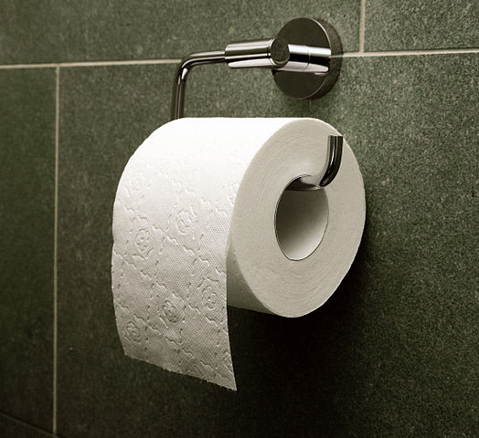

# How Many Kinds of People Are There?

```
There are 10 kinds of people in this world. 
Those who understand binary code and those who don't.
---seen on a T-shirt
```

## Things are about to get meta right from the start

I'm going to start off this book about data science and statistics with an unsubstantiated claim. My claim is this: People love to categorize themselves and others. They love to take quizzes online that tell you "what kind of person you are" in some way or another. They love to make statements that begin with, "there are two kinds of people in this world..." and so on. Ok? That's my claim. It's a bit of a mouthful.


Now, I just made a claim in support of which data *can absolutely* be brought to bear. But I won't use data to support it. What? Why not, for cyring out loud?! This is a book about data science!!! The reason is this: this book encourages you to think critically and skeptically about all kinds of ideas, claims, and questions. It tries to show you how to talk about these ideas precisely and not succumb to fallacies and bad intuition. But while trying to develop these skills, it is important to know when we are in turbo critical thinking mode (that's a technical term^[It's not really a technical term.]) and when we're not. Sometimes, we need to be able to say common-sense things and not have to support them.

What *exactly* am I even saying in my claim, you might be thinking? What do you mean by, "people love to" do X, where X, like ______ ["blank"], is a stand-in for some of the specific things I mentioned. That everybody does X? Most people? That people who do X derive pleasure above some pleasure threshold, thus designating "love" as opposed to "like?" You see, I could have tried to make my claim more precise. And I could have found polls and published reports that estimate just how many people have, by choice, taken some kind of person-category-test-thing, or posted funny jokes about "two kinds of people." But I'm just letting my claim stand as a common-sense claim. Just like if I said, people love going to the movies with friends. I wouldn't feel the need to cite a scientific study to support that claim.

Now, if someone is making what to *them* appears to be a common-sense claim but to you appears false or at least non-obvious, you have a few options. You can challenge the assumption and ask for evidence. Or you can accept the assumption, *for argument's sake*, to see where this is going. Hopefully, my claim feels common-sense to you too (we have that in common). If not, I'll just ask you to follow along to see where this is all going...

## Categories that count

Particulary when represented graphically or pictorially, "two kinds of people" questions have become something of an internet meme. There is even a whole [blog devoted to them by João Rocha](https://2kindsofpeople.tumblr.com/). The images below probably needs no explanation. 

```{r out.width='90%', echo=FALSE}

knitr::include_graphics("images/Toilet_paper_orientation_under.jpg")
```
sources [Wikimedia Commons User:Elya](https://commons.wikimedia.org/wiki/File:Toilet_paper_orientation_over.jpg), [Wikimedia Commons User:Elya](https://commons.wikimedia.org/wiki/File:Toilet_paper_orientation_under.jpg)

The [toilet paper orientation](https://en.wikipedia.org/wiki/Toilet_paper_orientation) is a distinguishing "test question" that separates people into one of two kinds. You choose one way or the other. Let's call this roll choice over_hang (shown on left) or under_hang (shown on right). Perhaps you have debated which is better with a friend or family member. Or perhaps you are lucky enough to have never thought about it at all. In any case, armed with this particular test question, we can go out an collect some data.


## Dimensions


Coming soon!
