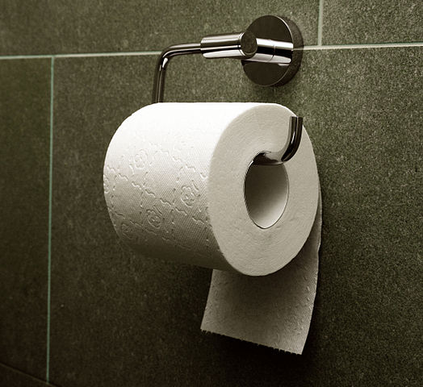

  
# How Many Kinds of People Are There? {-}


> There are 10 kinds of people in this world. 
> Those who understand binary code and those who don't.
> --- seen on a T-shirt

## Things are about to get meta right from the start {-}

I'm going to start off this first chapter in a book about data science with an unsubstantiated claim. My claim is this: People love to categorize themselves and others. They love to take quizzes online that tell you "what kind of person you are" in some way or another. They love to make statements that begin with, "there are two kinds of people in this world..." and so on. Ok? That's my claim. It's a bit of a mouthful.

Now, I just made a claim in support of which data *can absolutely* be brought to bear. But I won't use data to support it. What? Why not, for crying out loud?! This is a book about data science!!! The reason is this: this book encourages you to think critically and skeptically about all kinds of ideas, claims, and questions. It tries to show you how to talk about these ideas precisely and not succumb to fallacies and bad intuition. But while trying to develop these skills, it is important to know when we are in turbo critical thinking mode (that's a technical term^[Just kidding; it's not really a technical term.]) and when we're not. Sometimes, we need to be able to say common-sense things and not have to support them.

What *exactly* am I even saying in my claim, you might be thinking? What do you mean by, "people love to" do X, where X, like ______ ["blank"], is a stand-in for some of the specific things I mentioned. That everybody does X? Most people? That people who do X derive pleasure above some pleasure threshold, thus designating "love" as opposed to "like?" You see, I could have tried to make my claim more precise. And I could have found polls and published reports that estimate just how many people have, by choice, taken some kind of person-category-test-thing, or posted funny jokes about "two kinds of people." But I'm just letting my claim stand as a common-sense claim. Just like if I said, people love going to the movies. I wouldn't feel the need to cite a scientific study to support that claim.

Now, if someone is making what to *them* appears to be a common-sense claim but to you appears false or at least non-obvious, you have a few options. You can challenge the assumption and ask for evidence. Or you can accept the assumption, *for argument's sake*, to see where this is going. Hopefully, my claim feels common-sense enough to you too (i.e., we have that in common). If not, I'll just ask you to follow along to see where this is all going...


## Categories, counts, and kinds {-}

### Two Kinds of People {-}

"There are two kinds of people... which one are you?" questions have become something of an internet meme, particulary with the categorizations represented graphically or pictorially. There is a whole [blog devoted to them by João Rocha](https://2kindsofpeople.tumblr.com/). The images in Figure \@ref(fig:tp-fig) probably need no explanation, as they concern the great [toilet paper orientation](https://en.wikipedia.org/wiki/Toilet_paper_orientation) debate.


```{r include=FALSE}

require(knitr)
require(kableExtra)
require(dplyr)
require(ggplot2)
```
  
```{r tp-fig, echo=FALSE, out.width='90%', fig.show='hold', fig.cap="The great debate"}
include_graphics("../images/Toilet_paper_orientation_overunder.png")
#
```
source [Wikimedia Commons User:Elya](https://commons.wikimedia.org/wiki/File:Toilet_paper_orientation_over.jpg)

Toilet paper orientation is a distinguishing **test question** that separates people into one of two "kinds" (or "types" or "categories"; sometimes English has several words that are used interchangeably). A fancy word for this "splitting into two" is dichotomy (die-COT-uh-mee), from the Greek.  A **dichotomous question** has two possible answers. Here, you choose one way to orient the roll or the other. Let's call this roll choice "over" (shown on left) or "under" (shown on right). Perhaps you have debated which is better with a friend or family member. Or perhaps you are lucky enough to have never thought about it at all. In any case, armed with this particular test question, we can go out and collect some data. 

```{r echo=FALSE}
set.seed(201905071)
nump <- 40
probTP = 0.75
binomial_draw <- rbinom(nump,1, prob=probTP)
theWayIRoll <- ifelse(binomial_draw==1, "over", "under")
TPcounts <- as.data.frame(table(binomial_draw), row.names=c("under", "over"))
```

```{r tp-table, echo=FALSE}
### NOT LATEX COMPATIBLE
kable(table(theWayIRoll), col.names = c("", "count"), caption="How people roll", booktabs = TRUE) %>%
  kable_styling(bootstrap_options = "striped", 
                full_width = T) %>%
  kable_styling(latex_options = c("hold_position"))


# TPcounts %>% select(counts=Freq) %>%
#   kable(., caption="How I Roll", booktabs = TRUE) %>%
#   kable_styling(bootstrap_options = "striped", full_width = F, position = "float_right")

```

I went ahead and asked `r nump` people in Washington Square Park in New York City which kind of person they were, and the results are shown in Table \@ref(tab:tp-table). This being a book about data science, you might think I'm going to start calculating proportions right away, for example by saying that `r 100*round(prop.table(table(theWayIRoll))["over"],3)`% of New Yorkers are over-hangers. 
Nope. Although you should be able to figure out that proportion conversion, it is not the point I want to focus on right now. 

That point I want to focus on is that, based on our data, there *are* indeed two kinds of people here. If, for example, everyone in the world were an under-hanger (heaven forbid), then I couldn't very well say that there were two kinds of people in this world. At least not with regard to toilet paper orientation. It would be like if I presented you with the data in Table \@ref(tab:dumb-table). Looking at that, I can't very well convince you that there are two kinds of people.


```{r dumb-table, echo=FALSE}
### NOT LATEX COMPATIBLE
iamaperson <- data.frame(count = c(nump,0), 
              row.names = c("human","not human"))
kable(iamaperson, 
      caption="Kinds of people in Washington Square",
      booktabs = TRUE) %>%
  kable_styling(bootstrap_options = "striped", 
                full_width = T) %>%
  kable_styling(latex_options = c("hold_position"))

```

That all seems pretty obvious, in part because I made up a *tautology* in the second example there. Being a human being is automatically associated with everyone who can be a *kind of person*. 

But what if I had gotten exactly the same results for the toilet paper question? What if the data looked like Table \@ref(tab:tp-redux). In this **alternate universe**, everyone I ask in Washington Square is an under-hanger. Yes, it's one of those scary alternate universes, like the Twilight Zone. Anyway, does that mean that there is only one kind of person when it comes to toilet paper orientation? Well...not necessarily. After all, this was just a **sample** of people in Washington Square. It was not the whole **population** of Washington Square, even, let alone New York City, let alone the world.


```{r tp-redux, echo=FALSE}
### NOT LATEX COMPATIBLE
iamaperson <- data.frame(count = c(nump,0),
                         row.names = c("under", "over"))
kable(iamaperson, 
      caption="How people roll (alternate universe)",
      booktabs = TRUE) %>%
  kable_styling(bootstrap_options = "striped", 
                full_width = T) %>%
  kable_styling(latex_options = c("hold_position"))

```

### Samples and Populations {-}  

Samples and populations are sort of a big deal in statistics and data science, where these words have somewhat specialized meanings. Consider the following utterances, both of which make sense:

```
The population of New York City is 8.6 million
The population of New York City is ethnically diverse
```

Which is the population of New York City? In common usage, population often refers to the number or count of people, in a town, area, or country. Among statisticians and data scientists, population refers to a set or collection under consideration.  It doesn't have to be a set of people. It could be a set of rats, non-governmental organizations, or domestic flights originating Chicago. But let's suppose the population does refer to a set of people. The number of those people is just one summary about the population, also known as the total *count*. The proportion of over-hangers is another summary of the population, as is the most-common birth-month. 

If we always had access to all of the members in a population (the set or collection under consideration), the field of statistics wouldn't exist. We would just know a bunch of facts about, say, everyone in the whole world. And that would be that. While it is true that data are becoming more and ubiquitous, don't start betting on the demise of statistics. Even if we did have complete data for everyone in the world today, our population of interest might extend to the world as it will be next month, next year, or ten years from now. That is, we might want to make predictions about the future. In which case, we would want to draw *inferences* and to generalize from the data we have on hand---our sample---to data we don't have---the rest of the population. Making inferences from samples to populations will always be a compelling and challenging problem.

Since Washington Square is the center of my universe, that's where I sample. Even if we agreed that our population of interest were confined to Washington Square, we would still find it difficult to collect data on everyone there. There are a lot of them, many of them are on skateboards, and new people keep leaving and entering the park. It turns out, that's okay. We don't actually have to reach everybody to be able to do data science. However, we need to understand that when we sample 40 particular people in Washington Square, we might not get the same exact answers as if we had sampled 40 *different* people. The sampling process introduces an element of **uncertainty** into our process.

Coming back to our toilet paper debate, if we did find zero over-hangers in one sample, it doesn't guarantee that the number of over-hangers will also be zero in the next. The number may vary from sample to sample. Uncertainty does not, however, mean that the information derived from one sample is useless. In fact, soon we'll see that we can actually learn a lot from a sample simply by recognizing that sample values will vary. We can simulate samples on a computer to see how much they will vary. And then, using our simulations, we will be able to give probabilistic answers to questions like, "what are the chances that there really are no over-hangers in Washington Square?"


### Summarizing data {-}

When I presented my survey results to you in Table \@ref(tab:tp-table), notice that I did not present you with the raw data, but rather with a summary of the data. The particular summary I used was called "counts", that is, a total count of how many people responded "over" or "under." The raw data, in contrast, would have contained each individual response I collected, labled either with a name of the individual, or perhaps with some other unique identifier (such as a random number), or---if I don't need to keep track of particular individuals---with just a row number. Something like this, if we examine at the first six responses rather than all 40 of them. Raw data:

```{r, echo=FALSE}
rawdata <- data.frame(randomID = 
                        round(runif(length(theWayIRoll),
                        min=1000, max=9999)),
                        response=theWayIRoll)
kable(head(rawdata)) %>%
  kable_styling(latex_options = c("hold_position"))
```

Counts is an example of a **summary statistic**, which is a fancy term for a number that is derived from the raw data. The count summary is as simple as it gets. It is literally the number of times that each response appears. We might note as well that, 

```
count(under) + count(over) = total number of responses.
```

This mathematical statement is true because there are only two possible responses. If there were more than two responses, then I would need to add the counts for each possible response. 

Note that the *proportion* of "over" responses is also a summary statistic (which is just the counts of "over" divided by the total number of responses). Another summary statistic could be the ratio of "over" responses (counts) to "under" responses. For example, one way people use summary statistics in reporting data is through statements like, "twice as many people prefer chunky peanut butter to smooth." 

<div class="rmdtip">
**No mean feat.**

Whenever someone reports a mean (another word for average) value of some set of data, that is also a summary statistic. Does it make sense to construct an average from responses that are either "over" or "under"? No, it doesn't. That's because {over, under} is a categorical response, and you can't average over categories. Unless you're trying to make fun of statistics with a puerile joke. Different versions of this joke appear: "the average American has one tit and one testicle." At the risk of explaining the joke too much, here goes: Tits and testicles can certainly be treated as numerical data, and hence can be averaged. This joke hinges on the fact that the existence of testicles (or tits) is associated with a person's sex, which is categorical and not numerical. Assuming that half of all Americans are female (roughly true), we can't say that the average American is half male and half female. The real "punch" of this joke is to suggest that summary statistics about averages are just a bunch of nonsense. What do you think?

</div>

This is about as much as we need to say about summary statistics for the time being. But they'll be back. 


### Checkpoint {-}  

While focusing on the great toilet paper debate, we've managed to establish some important fundamental ideas. 

- Dichotomous questions split people into two kinds, but only as long as it is actually possible for both answers to occur. 

- In an alternate universe, people might give different answers than they do in this one. (Seriously, this is an important idea).

- Even when we casually refer to *people*, we may have a particular set of people, a population, in mind. Data about this population are likely to come from a sample, rather than from the whole population, and this fact introduces some uncertainty into claims about the whole population. Data science to the rescue!

- Clearly, we can ask people questions that prompt them to choose between more than two categories. But "two types of people" questions are more fun.^[That was another unsubstantiated claim.] I mean there are so many of them! So... does that mean that there really are two types of people? To answer this, we will need to get into another great debate.  

\pagebreak   

## Dimensions {-}


> "I always said if I had one breakfast to eat before I die, it would be Wonder Bread toasted, with Skippy Super Chunky melted on it, slices of overripe banana and fresh crisp bacon."
>
> --- [Michael Bloomberg](https://nypost.com/2008/07/26/mayors-last-meal-is-a-killer/)


Former NYC mayor Michael Bloomberg is a chunky peanut butter kind of person. Are you? As peanut butter comes in "smooth" and "chunky" varieties (also known as creamy and crunchy, respectively), this question is also a dichotomous one. However, if we add this test question to our question pool, in addition to the one about toilet paper orientation, we will soon find that having two two-kinds-of-people questions begins to imply more than two kinds of people. Wait, what?

See, back when I went to talk to the people in Washington Square, I also asked them about the great peanut butter debate. As you can see from Table \@ref(tab:pb-counts), smooth came out slightly ahead. 

```{r, include=FALSE}
set.seed(201905072)
probPB = 0.66
binomial_draw <- rbinom(nump,1, prob=probPB)
theWayISpread <- ifelse(binomial_draw==1, 
                        "smooth", "chunky")
wsq_peeps <- data.frame(roll=theWayIRoll, spread=theWayISpread)
```

```{r, 'pb-counts', echo=FALSE}
kable(table(theWayISpread), col.names = c("", "counts"), caption="How people spread", booktabs = TRUE) %>%
  kable_styling(bootstrap_options = "striped", full_width = T)%>%
  kable_styling(latex_options = c("hold_position"))
```
But this second question did not erase the first question about toilet paper. In fact the first few rows of our data from Washington Square are displayed below. Each row, representing one person, now has two columns, labeled "roll" (for toilet paper) and "spread" (for peanut butter): 

```{r, echo=FALSE}
head(wsq_peeps)
```

You may have noticed that among the first six people for whom I have shown data, none of them answered both over and smooth. But such response pairs exist. In fact, if we count each combination as it occurs--that is, under-chunky, over-chunky, under-smooth, and over-smooth--we get the results shown in Table \@ref(tab:tpxpb). There are four combinations, because we have two questions with two possibilities (dichotomies) for each. 

Before you read on, it's a good time to ask yourself if you can answer the following questions (answers in the footnote): (a) if there were two questions with three categories each, how many combinations could be observed? (b) if there were three dichotmous questions, how many combinations could be observed?^[(a) If the categories for each question are A, B, and C, we can get AA, AB, AC, BA, BB, ... etc. We multiply the number of categories as many times as we have questions. So 3\*3 = 9. (b) This time we have three questions, and for each one we have two options, so there are 2\*2\*2=8 possible combinations.]


```{r, 'tpxpb', echo=FALSE}
kable(table(wsq_peeps$roll, wsq_peeps$spread), caption="Two questions", booktabs = TRUE) %>%
  kable_styling(bootstrap_options = "bordered", 
                full_width = F)%>%
  kable_styling(latex_options = c("hold_position"))

```


Table \@ref(tab:tpxpb) is an example of a kind of table that is so common in data science, it has its own name. Three of them, in fact. It is sometimes called a cross table (or crosstab), or a **two-way table** (makes sense), but most commonly it is known as a **contingency table** (wha? I'll explain later) I'm sorry that there are three names for the same thing. Really I am.

Ok, now things are about to get deep. The title of this chapter is "How Many Kinds of People are There?" And we've now explored how using two two-kinds questions leads to four types. You've probably figured out yourself that you take the product (i.e., multiply) of the number of categories in each of the questions, and that tells you how many "buckets" you can have overall. But still, there are different ways to arrive at different bucket numbers.

```{r, 'newpb', echo=FALSE}

fourWaySpread <- theWayISpread
dontcare <- sample(nump, 7)
haters <- sample(dontcare, 4)
fourWaySpread[dontcare] <- "don't care"
fourWaySpread[haters] <- "hate all"

kable(table(fourWaySpread), col.names = c("", "counts"), caption="PB preference", booktabs = TRUE) %>%
  kable_styling(bootstrap_options = "striped", 
                full_width = F)%>%
  kable_styling(latex_options = c("hold_position"))
```
 Consider Table \@ref(tab:newpb) in contrast to \@ref(tab:tpxpb). We've now given people four choices to express their peanut butter preference. In addition to chunky and smooth, they can also choose to say that they hate all peanut butter or don't care. We now have four kinds of people. But since we make the determination of what kind of person you are using just one question, we say that there is one **dimension** (in this case, peanut butter preference) along which people can be divided into four groups. In Table \@ref(tab:tpxpb), there were two dimensions, a dimension of peanut butter and a dimension of toilet paper. Notice that this word, dimension, is used in much the same way as when we refer to geometric space as being two-dimensional (e.g., a drawing on flat sheet) or three-dimensional (e.g., a solid object, or sometimes a drawing that creates the illusion of looking at a solid object.) The three dimensions of space are often labeled something like (x, y, z). Here, our two dimensions could be labeled (pb, tp). The order doesn't matter. To summarize, in Table \@ref(tab:tpxpb), we have two dimensions and four kinds. In Table \@ref(tab:newpb), we have *one* dimension and four kinds.
 
So far so good: two questions, two dimensions, right? Well... maybe. We already saw that if a question does not actually divide people into kinds, because only one answer appears, then it doesn't really count. It is not a dimension. In our contingency table representation, this might look like the left side of Table \@ref(tab:tpxpb-alt). In an alternate universe, no one prefers smooth to chunky. Another way to say it is that the peanut butter question is not **informative** because it has no **variance**. Everyone in our sample is the same.


```{r, 'tpxpb-alt', echo=FALSE, results='asis'}

orig_xtab <- table(wsq_peeps$roll, wsq_peeps$spread)
alt_xtab1 <- orig_xtab
alt_xtab1[1,1] <- alt_xtab1[1,1] + alt_xtab1[1,2]
alt_xtab1[2,1] <- alt_xtab1[2,1] + alt_xtab1[2,2]
alt_xtab1[1,2] <- alt_xtab1[2,2] <-0
  
alt_xtab2 <- orig_xtab
alt_xtab2[1,2] <- alt_xtab2[1,1] + alt_xtab2[1,2]
alt_xtab2[2,1] <- alt_xtab2[2,1] + alt_xtab2[2,2]
alt_xtab2[1,1] <- alt_xtab2[2,2] <-0

kable(list(alt_xtab1, alt_xtab2), caption="Two questions (alternate universes)", booktabs = TRUE) %>%
  kable_styling(bootstrap_options = "bordered", full_width = F)%>%
  kable_styling(latex_options = c("hold_position"))

#saveRDS(alt_xtab2, file="alt_xtab2.rds")
```
But now consider the alternate universe on the right of Table \@ref(tab:tpxpb-alt). In that case, everyone who is an over-hanger of toilet paper prefers smooth peanut butter, and everyone who is an under-hanger prefers chunky. If this is the case, there are only two kinds of people, at least in our sample. Those who over-hang _and_ prefer smooth and those who under-hang *and* prefer chunky. But does it make sense to say there are two dimensions? We did ask two different questions!

You might reason about it the following way: in our sample, if I ask anyone just one of the two questions--about either toilet paper or peanut butter--then I immediately know the answer they would give to the other one. I don't actually have to ask two questions, other than to establish in the first place that I didn't have to. Since I only get information from one question, there is only one dimenion.  
  
\pagebreak   
  
## Independence, Association, and Contingency {-}

> This section title sounds like a philosophy book by the late Richard Rorty. 
> --- inner voice


We just spent a little bit of time in an alternate universe, a bizarro world in which knowing how someone prefers to orient their toilet paper tells you what style of peanut butter they like, and *vice versa*. Notice that this knowing-about relationship is symmetric, and that in fact, the two representations as shown in Table \@ref(tab:tpxpb-alt2way) are informationally equivalent.


```{r, 'tpxpb-alt2way', echo=FALSE, results='asis'}

kable(list(alt_xtab2, t(alt_xtab2)), 
      caption="Alternate universe (two equivalent ways)",
      booktabs = TRUE) %>%
  kable_styling(bootstrap_options = "bordered", 
                full_width = F)%>%
  kable_styling(latex_options = c("hold_position"))

```

In our regular universe, however, this relationship was not observed. In Table \@ref(tab:tpxpb), all four possible combinations occur. When knowledge about a person's answer to one question provides information about their answer to another question, we say that the two answers are **contingent** upon one another. This is the reason we called the two-way table a contingency table in the first place, although it is still called that even when two answers are not contingent. Go figure. Contingent is another word for **dependent**. To make matters worse, we *also* often say that the two responses are **associated**. 

In our bizarro world scenario, one answer completely determines the other. This **deterministic** relationship is one extreme in the spectrum of association/dependence/contingency. At the other extreme, if the two responses are not at all associated/dependent/contingent, then we say that they are **independent**. To say that two responses are independent is to assert that knowing one of them does not give you any information about what the other one might be. This would have been my intuition, at least, about toilet paper and peanut butter. But whether they are independent or mildly associated with one another is an empirical question, which means we should try to answer it with data. In bizarro world, where they were deterministically related, we might reasonably want to know why. Could there be a gene that turns on toilet paper orientation and peanut butter preference at the same time?  

It is worth noting that a single dataset often can't tell us for sure whether two variables are independent, associated/dependent/contingent, or deterministic. Suppose for a moment that we saw this contingency table:  

```{r, echo=FALSE, results='asis'}
orig_xtab <- table(wsq_peeps$roll, wsq_peeps$spread)
alt_xtab3 <- orig_xtab
alt_xtab3[1,1] <- 17
alt_xtab3[1,2] <- 4
alt_xtab3[2,1] <- 3
alt_xtab3[2,2] <- 16
kable(alt_xtab3, caption="Two questions", booktabs = TRUE) %>%
  kable_styling(bootstrap_options = "bordered", 
                full_width = F)%>%
  kable_styling(latex_options = c("hold_position"))

```
  
You might think, wow! It looks like toilet paper preference is associated with peanut butter preference: People who prefer chunky peanut butter also seem more likely to be over-rollers, and people who prefer smooth peanut butter are more likely to be under rollers. How weird!  

Now, you intuitively know that if you go back out onto Washington Square and you find 40 different people, these numbers probably won't be exactly the same. There is some element of randomness, and it's basically impossible to know what the data would look like if you could ask every single person in the world.  

Instead, statisticians like to use something called **hypothesis testing**. This often involves coming up with a **null hypothesis** (in this case, the null hypothesis might be that peanut butter choice and toilet paper rolling are independent) and an **alternative hypothesis** (in this case, the alternative hypothesis might be that peanut butter choice and toilet paper rolling preference are dependent). Then, it is often possible to simulate what might happen by random chance under the null hypothesis and check if our observations are consistent with the null or not. This can lead us to either accept the null hypothesis, or "reject the null" in favor of the alternative.  

Let's first take a look at what this dataset looked like before we tabulated it. There were 40 people sampled, and they each asked two questions. Let's look at the first five rows of data:  
```{r, echo=FALSE, results='asis'}
data_example = data.frame(Peanutbutter = 
                            c(rep("Chunky", 17), rep("Smooth", 4),
                              rep("Chunky", 3), rep("Smooth", 16)),
                          Toiletpaper = 
                            c(rep("Over", 21), rep("Under", 19)))
rownums = sample(1:40)
data_example = data_example[rownums,]
rownames(data_example) = NULL
kable(data_example[1:5,])%>%
  kable_styling(latex_options = c("hold_position"))
```
  
One way to think about the situation where toilet paper and peanut butter choices are independent is this: We keep the same proportions of answers to each question, but we randomly shuffle them separately. This is akin to writing every person's response to the peanutbutter question on an index card, shuffling them randomly, and then re-distributing them; then, doing the same for the toiletpaper question. If we shuffle responses to each question separately, there is no way for someone's randomly assigned answer to one question to influence their randomly assigned answer to another. 

In the initial dataset, we found that 17/20 or 85% of people who preferred chunky peanutbutter also rolled their toilet paper "over". If we randomly re-shuffle people's answers 1000 times, then we can calculate the percentage of chunky peanutbutter people who roll their toilet paper "over" for each shuffled dataset. This will give us a sense for what kinds of values we might expect to see by random chance if the null were true (i.e., if these questions were actually independent). The code to do this is below (you do not need to perfectly understand it yet - we will come back to this later!).  

```{r}
simulated_proportions = vector()
for(i in 1:1000){
  data_example$Peanutbutter = sample(data_example$Peanutbutter)
  data_example$Toiletpaper = sample(data_example$Toiletpaper)
  simulated_proportions[i] = table(data_example)[1,1]/20
}

hist(simulated_proportions, 
     main = "Proportion 'over' given chunky PB",
     xlab = "Proportion 'over' given chunky PB under null",
     xlim = c(0,1))
abline(v=0.85, lwd=2, col=3, lty=2)
```
  
We will cover histograms later in this chapter, so don't worry too much if this picture doesn't make sense to you yet. For now, the main takeaway is this: Even if we randomly reshuffle everyone's answers 1000 times (akin to going out on the street and asking 40 new people these questions 1000 different times, but assuming that the overall proportions of over vs. under rollers and chunky vs. smooth PB people will be the same as in our original dataset), we would not expect to see values as high as 85% (green dotted line) if the questions were truly independent.   

\pagebreak  

## Latent Factors and Measurement {-}  
     
```{r apps-windows, echo=FALSE, fig.show='hold', fig.cap="Two more two-kinds questions"}  

include_graphics("../images/two-two-kinds.jpg")  

```    
  
  
Figure \@ref(fig:apps-windows) ([source](https://2kindsofpeople.tumblr.com/)) shows two more two-kinds of people graphics from João Rocha's blog. I bet that you can identify yourself with one of the two images in each pair. I certainly can. But ask yourself, given our discussion above, do you think the choices a person would identify in each case above are independent or not independent (e.g., contingent, associated, dependent)?

In contrast to the toilet paper and peanut butter questions, which at least appear to be about totally different things, these two dichotomies have something similar going on in each of them. The choice on the left is about organizing your desktop browser, either in tabs or as separate windows. The choice on the right is about organizing apps in your smartphone, either loose or in folders. We might say that both of them get at a tendency to organize your digital environment. Call it digitidness (short for digital tidiness). This tendency, we may imagine, might even carry over into non-digital environments, like your actual desk, bookshelf, or filing cabinet.

What we've done here is to try to explain the association between responses to the two questions (assuming that there is, i.e. that they are not independent) by appeal to some underlying **latent factor**. We say a factor is latent (meaning hidden) because we don't observe digitidiness itself directly, but we only observe tidy browsers or smartphone app folders. Perhaps you can think of another candidate factor besides digitidiness. In any case, we might propose that each of the two two-kinds questions in Figure \@ref(fig:apps-windows) are in fact indirect **measurements** of the same factor. If so, this could explain why the two answers woudl be associated.

> Notice that a **factor** is also a dimension, in the sense we used before. We could have said "latent dimension", but we tend to use the word factor when we are drawing attention to the specific nature of the dimension rather than just counting. We also sometimes use the word **trait**. At least in psychology, trait tends to be reserved for stable psychological factors. Thus "stress" can be a factor but not a trait, whereas "social anxiety" may be a trait, if it is persistent. In this case, digitidiness might be considered a trait (and thus also a factor and a dimension). 

Contrast this with toilet roll orientation, which we can observe directly just by looking in someone's bathroom. (We assume that they are telling the truth when they answered our questions, but we could in principle verify it.) It was only in the bizarro world when toilet roll orientation and peanut butter preference were perfectly related that we started to wonder if there maybe *was* an underlying genetic factor. Genetic factors were once not directly observable either, but we assumed them for explanatory value. Today we can of course observe specific genetic variation, although there are still many gaps in our understanding of the relationship between genes and observed behaviors.

Consider some data again, in two possible worlds, shown in Table \@ref(tab:tabsxapps). On the left, we have the deterministic scenario we saw before. As before, we identified this situation as having two kinds of people and really just one dimension. In contrast to before, where we had no real explanation for this coincidence, we attribute it now to some factor, like digital tidiness.


```{r, 'tabsxapps', echo=FALSE, results='asis'}

tabsxapps <- matrix(c(21,0,0,19), nrow=2)
tabsxapps2 <- matrix(c(16,5,6,13), nrow=2)
rownames(tabsxapps2) <- rownames(tabsxapps) <- c("tabs","browser")
colnames(tabsxapps2) <- colnames(tabsxapps) <- c("folders","apps")

kable(list(tabsxapps, tabsxapps2), 
      caption="Possible data for digital tidiness", 
      booktabs = TRUE) %>%
  kable_styling(bootstrap_options = "bordered", full_width = F)%>%
  kable_styling(latex_options = c("hold_position"))

```

But now consider the possible results in the table on the right. Since all four possible quadrants have non-zero counts, we see that knowing whether someone organizes their browser using tabs does not completely (i.e., *deterministically*) specify whether or not they put their apps into folders. On the other hand, one answer *does seem to be associated* with the other. Notice that the values are still much higher in the "buckets" that we think of as indicating the presence or absence of digitial tidiness. These are the tabs-folders bucket (tidy) or the windows-loose bucket (not tidy). We say that the tidiness factor appears to explain much of the observed range, or **variance**, in responses to the two questions. But it doesn't explain all of it, since there are people (11 out of 40, in this case) who don't fall into one of these buckets. 

This situation on the right is probably more realistic. After all, very few things in this world are absolute (unlike in bizarro world). So now the big question re-emerges: are there two kinds of people or four? One dimension, or two? It's sort of...like...in between...?

<div class="col2">
**Golda says**: Although digitidiness explains a lot of what we see in our data, it doesn't explain it all. I believe that desktop tidiness and mobile tidiness are different, if related, tendencies. For example, when we use mobile phones, we're typically on-the-go and have less time. If we knew more about the people in our sample, we might see that these discrepancies in the organization of apps and tabs actually relate to other aspects of their lives. So, I say there are two dimensions.

**Sidney says**: Digitidiness is the only real factor here, but people may not always be consistent in these particular behaviors. Also some people are only sort-of-tidy, and apply this tidiness unevenly but randomly. These two-kinds of people choices don't leave room for shades of gray, so that's what we're seeing in the mixed categories where people are tidy in one environment and not in another. But ultimately there is really just one dimension here.
</div>


**What do you think?**  

\pagebreak   

## (An Infinite Number of) Shades of Gray (or Brown) {-}

We've taken the two-kinds-of-people idea pretty far in this chapter already. But it's time to acknowledge the elephant in the room. Not every question about attributes, preferences, or behaviors  can be answered in such an either/or manner. Digitidiness might be one of those things. Consider the following dialogue:

> Stacy: "There are liberal and conservative kinds of people, Trang. Which one are you?"
> Trang: "Well, you know I’m not sure I’m exactly one or the other. I think I'm somewhere in the middle."

Although we often use them as **discrete categories**, the words liberal and conservative might be better thought of as endpoints of **continuous scale**. In fact, they might even apply to different *dimensions* of political thought with respect to social issues or economic issues. If you think about it, it's not hard to come up with other examples of "categories" that really just describe one end or another of a continuous scale. Yes, there are short people and tall people, but everyone has a height, and a lot of people are "about average." Height is just a number on some scale. So it wouldn’t necessarily make sense to put people into the categories of tall or short.

In the great toilet paper debate, we were able to identify two kinds of people based on two possible responses to the question of roll orientation. Two answers; two kinds. If instead of discrete categories, we have a number on a continuous scale, does that mean that there can't be "kinds" of people anymore? To answer this question, we'll need to understand what exactly we're talking about when we characterize people using a continuous scale.

Consider poopiness. On a scale where some people are really poopy (close to poopiness = 1), some aren't poopy at all (close to 0), and many are somewhere near the middle. That's not a very quantitative description. I used the words "some" and "most", but I didn't give you counts like I did in Table \@ref(tab:tp-table) about toilet roll orientation. I will try to do that in just a minute. Meanwhile, notice that scale here runs from 0 to 1, which I will also sometimes write as [0,1]. When it comes to height, we have established scales, like inches or centimeters. But when it comes to liberalism or poopiness, the scale does not necessarily refer to something we can see directly. Nevertheless we can use the scale to compare people and to see how a whole bunch of people "measure up." I've set the scale to [0,1], because it is a common scale, but it could have run from 1 to 10, for example, without significantly changing anything in what I'm about to say. 

If I showed you the poopiness data for a sample of people, the list would look something like Table \@ref(tab:poopy-counts). As before, in this table each row stands for one person. To protect their identities, everyone is identified only by a number (e.g., 0083), which is shown in the first column. In the second column is each person's poopiness value. 
  
```{r poopy-counts, echo=FALSE, fig.pos="H"}
set.seed(101010)
poopycrappy <- read.csv("../data/poopycrappy.csv")
poopycrappy <- poopycrappy[sample(nrow(poopycrappy)),]
row.names(poopycrappy) <- sprintf("%04d", as.integer(row.names(poopycrappy)))
poopycrappy %>% select(poopiness) %>% 
  round(.,3) %>% 
  head() %>% 
  kable(., booktabs = TRUE, 
        caption = "Don't ask me how I got these numbers.")%>%
  kable_styling(latex_options = c("hold_position"))

```
  
Poopiness is shown as a decimal number. Part of the reason I've used this scale, instead of 1-100, is to emphasize that the data values can be arbitrarily close to one another. Two values may be different by 0.1 or 0.03, or even 0.000027, if we have enough precision in our data to say such a thing. These data are called **numerical** or **quantitative** as opposed to **categorical**. There are actually 148 values in the data set, but I've only shown the first six in Table \@ref(tab:poopy-counts). 

It's not as easy to make sense of a bunch of decimal values like this as it is to look at simple counts of categories (like 17 for chunky, 23 for smooth). However, this sense-making problem has been solved by representing the same data using dot plots, stacked dot plots, frequency tables, and histograms, which you can read all about in any standard textbook (for example OpenIntro Statistics, Chapter 2). I'm going to go straight into the **frequency table** and **histogram**, which you've probably seen before. These are the most commonly used representation for data of this kind. 

Again, it is a bit awkward to count how many people have poopiness value of exactly 0.473. Maybe there is one, maybe none. How would we interpret that answer, anyway? Instead, we can group values into ranges, or "bins", e.g. 0-0.05, 0.05-0.1, 0.1-0.15, etc. and then count how many of our data fall into each bin.^[Technically, each range is a semi-open interval, e.g. (0.1,0.15\], so that any values exactly equal to 0.1 can only be included in one bin and not the ones on either side.] This table of counts is typically called a frequency table. Frequency is just another word for counts.


  
```{r poopy-freq, echo=FALSE, fig.pos="H"}
br = seq(0,1,by=0.05)
ranges = paste(head(br,-1), br[-1], sep=" - ")
freq   = hist(poopycrappy$poopiness, breaks=br, plot=FALSE)

tmp <- data.frame(Range = ranges, Frequency = freq$counts)
kable(tmp, caption="Frequency Table for Poopiness", booktabs = TRUE) %>%
  kable_styling(bootstrap_options = "striped", 
                full_width = F)%>%
  kable_styling(latex_options = c("hold_position"))

```
  
```{r poopy-hist, echo=FALSE, fig.cap='Histogram of Poopiness', fig.pos="H"}
col = c(0,0,0,0,0,0,0,0,rgb(1,0,0,0.2),0,0,0,0,0,0,0,0,0,0,0)
h <- hist(poopycrappy$poopiness, main="", breaks=seq(0,1.01,0.05), col=col, xlab="poopiness")
axis(1, at=0.45, labels="")
```
  
A histogram is a bar plot of counts for poopiness values that fall into certain numerical ranges. So it's a bar plot of the data in Table \@ref(tab:poopy-freq). But oftentimes you'll just see the histogram without the frequency table.

Consider the range of poopiness values from 0.40-0.45. Our data set has 9 values in this range, as you can see in Table \@ref(tab:poopy-freq), so the height of the bar above this range of values on the x-axis (horizontal axis) is 9. I've colored it in pink only to help you see what I'm referring to. The y-axis in Figure \@ref(fig:poopy-hist) is labeled "Frequency", as in the table. Some more jargon: the numerical values that separate the bins are called "breaks." In Figure \@ref(fig:poopy-hist), the breaks are at increments of 0.05.


> Question: Given that there are 20 possible bins in the histogram in Figure \@ref(fig:poopy-hist), but only some of them have non-zero counts, are there 20 kinds of people (in terms of poopiness) or 15 kinds of people?


Trick question? You bet. The breaks (and thus bins) in a histogram are arbitrary. I can choose any breaks I want, as long as all of the data points fall into exactly one bin. (I can't just exclude some bins, though. That would be cheating.) The histograms in Figure \@ref(fig:poopy-hist-alt) are both perfectly valid histograms. One of them has four bins, and one of them has only two bins.

   
```{r poopy-hist-alt, echo=FALSE, fig.cap='Other Histograms of Poopiness', fig.pos="H"}
par(mfrow=c(1,2))
hist(poopycrappy$poopiness, main="", breaks=seq(0,1.01,0.25), xlab="poopiness")
hist(poopycrappy$poopiness, main="", breaks=seq(0,1.01,0.5), xlab="poopiness")
```
   

It's tempting to take the counts on the right of Figure \@ref(fig:poopy-hist-alt) and declare that there are two kinds of people. After all, this gets us back to familiar territory. Ta-dah!
   
```{r poopy-two-kinds, echo=FALSE, fig.cap='This is a terrible, horrible, no-good, very-bad thing to do.', fig.pos="H"}
h2 <- hist(poopycrappy$poopiness,  breaks=seq(0,1.01,0.5), plot = FALSE)
barplot(h2$counts, main="Two kinds of people", names.arg=c("not poopy", "poopy"))
```  
  
As you can tell, because it says so right in the figure caption, this is terrible, horrible, no-good, very-bad thing to do. Why is it a bad thing to do?

a) The split was made at 0.5 on the poopiness scale, but that is not the average value of poopiness in the data set, which  is closer to 0.57, as can be seen in Figure \@ref(fig:poopy-hist) (or from the "raw" data themselves).
b) You should always use at least 5 bins when you have numerical data
c) Representations of data should communicate honestly about the nature of the data themselves. In this case, poopiness is not a category.


What I did here was take a numerical/quantitative value (poopiness) and mis-represent it as a categorical value. I did it by *dichotomizing* it, i.e., by splitting off everyone above 0.5 and labeling them as "poopy". I could have alternately split at the mean or median value and labeled the resulting two groups as "low poopiness" and "high poopiness." But this would still have been a mis-representation. It would hide the fact that poopiness comes in a continuous range of values. 

> ASIDE (*delivered in a hushed voice*): I won't be able to convince you of this now, but it turns out that if you do this---if you dichotomize numerical data---you will BREAK STATISTICS! Ok, that sounds a bit dramatic. But in all seriousness, one of the jobs of statistics is to understand associations between different variables, such as poopiness and, say, earning potential. If you treat poopiness (or other variables) as discrete when they are really continuous, you may very well get the wrong answers. As the man down the street from where I used to live often muttered to himself while waving his arms in the air, THAT IS AN ABSOLUTE IRONCLAD MATHEMATICAL FACT. No, but in all seriousness, there is a terrific paper on exactly this subject [@maccallum2002]. 

Dang it! you say. You've taken me down this rabbit hole of poopiness for too long. How many kinds of people are there? Are you saying that if one looks at properties that are described by numbers instead of categories, that there is only one kind of person? Is it all just shades of gray (or brown)?

### Mixtures {-}

Remember Figure \@ref(fig:poopy-hist)? (Don't click it!) Here it is again so you don't have to scroll back. Data scientists like to say this picture shows you the **distribution** of poopiness in our sample. Statisticians use the word distribution in a more formal way that is best put off until we actually need it. We don't need it yet.
  

```{r poopy-hist2, echo=FALSE, fig.pos="H", out.extra = ''}
h <- hist(poopycrappy$poopiness, main="", breaks=seq(0,1.01,0.05), xlab="poopiness")
```
  
What if I told you that there ARE two kinds of people; you just can't see them unless I give you special glasses (or more information). If I gave you special glasses (or information), you would see this:


  
```{r poopy-hist-mixture, echo=FALSE, fig.cap='A mixture of poopiness', fig.pos="H", out.extra = ''}

p1 <- poopycrappy %>% filter(.,class=="C1") %>% select(poopiness) 
p2 <- poopycrappy %>% filter(.,class=="C2") %>% select(poopiness) 
hist(p1$poopiness, main="", breaks=seq(0,1.01,0.05), col=rgb(1,0,0,0.3), xlab="poopiness")
hist(p2$poopiness, col=rgb(0,1,0,0.3), add=T)

```
  

*By what dark magic have you colorized the data!* you say. Or, perhaps you just said, hm, interesting. 
In Figure \@ref(fig:poopy-hist-mixture), I've made a histogram with bars in two different colors, light green and pink. The colors are slightly transparent so that you can see both the green and pink distributions in their entirety even though they overlap. That's what the brownish bars mean. You're looking at the overlap of the green and pink bars, not another set of bars. Now, if you compare this histogram closely with the original, colorless histogram above, you'll see that the bin ranges are the same (width=0.05), and the the counts of green and pink bars add up to the total values that we had before. If there are green people and pink people, or in any case two different kinds of people, and if their poopiness is distributed as shown in Figure \@ref(fig:poopy-hist-mixture), then the poopiness of the mixture of these two groups of people will look just like Figure \@ref(fig:poopy-hist).

Ok, but that doesn't explain how you would know that there are two groups. If I didn't tell you. That's because *you wouldn't necessarily know. You would need to have more information*. Now you might suspect something if you saw a distribution that looked like this:

  
```{r poopy-hist-mixture-suspicious, echo=FALSE, fig.cap='A suspicious mixture of poopiness', fig.pos="H", out.extra = ''}

hist(c(p1$poopiness, p2$poopiness-0.12), main="", breaks=seq(0,1.05,0.06), xlab="poopiness")

```
  
In Figure \@ref(fig:poopy-hist-mixture-suspicious), the distribution has a double-hump like a Bactrian camel. In spite of that, it is not called a Bactrian distribution--which would make me happy--but a **bimodal** distribution. The point that I'm trying to make here is that a bimodal distribution makes you suspect that there could actually be two groups mixed together in our data. 

But the original data for poopiness did not look bimodal. I suggested to you that you would need more information to determine if there are two groups. And so, I present you with... Crappiness! For each of the subjects in our poopiness data set, we have also collected data on their crappiness. Crappiness is also a numerical value ranging from [0,1]. It's sort of like poopiness, but different. Here are some values:

  
```{r, echo=FALSE, fig.pos="H", out.extra = ''}
# set.seed(101010)
# poopycrappy <- read.csv("data/poopycrappy.csv")
# poopycrappy <- poopycrappy[sample(nrow(poopycrappy)),]
poopycrappy %>% select(poopiness, crappiness) %>% round(.,3) %>% head()
```
  
And here...(drum roll please)... is a histogram of crappiness!

  
```{r crappy-hist, echo=FALSE, fig.cap='Histogram of Crappiness', fig.pos="H", out.extra = ''}
h <- hist(poopycrappy$crappiness, main="", breaks=seq(0,1.01,0.05), xlab="crappiness")
```
  
Hmm. I bet you were hoping that the crappiness data would look obviously bimodal, but it's not obvious. Nevertheless, hopefully you trust that I wouldn't lead you on a wild goose chase for no reason. Perhaps you can even see it coming. If we look at poopiness and crappiness separately, there is no clue that there might be distinct groups of people in our data set. But if we look at them together... there is. 

When we looked at categorical data for two two-kinds-of-people questions, we made 2x2 contingency tables. We also used the word "dimension", for example to say that we were describing people along two dimensions (recall: toilet paper and peanut butter). Now that we are looking at numerical data (poopiness and crappiness), we can also use two dimensions, as in a two-dimensional scatterplot, to examine both variables at once. This scatterplot is shown in Figure \@ref(fig:poopy-crappy). Each point represents data from one person, with their poopiness value on the x-axis and crappiness on the y-axis.

  
```{r poopy-crappy, echo=FALSE, fig.cap='Scatterplot of Crappiness vs Poopiness',fig.pos='H', out.extra = ''}

plot(poopycrappy[,c(1,2)], xlim=c(0,1), ylim=c(0,1))

```
   

<div class="rejoice"> Alas, oh data! Your bimodal nature has revealed itself in the higher-dimensional plane! </div>  

  
How many kinds of people are there? When it comes to poopiness and crappiness, people exhibit a continuous range of values, so we can't neatly put them into buckets. Neither poopiness nor crappiness appear to be bimodally distributed on their own. However, when examined together, as in the scatterplot in Figure \@ref(fig:poopy-crappy), a pretty suggestive pattern emerges in the data. There are two **clusters** of points, one group of which is lower in poopiness but higher in crappiness than the other. Interestingly, though, in both groups poopiness and crappiness tend to increase together. That is, they appear to be associated, not independent.

I do not mean to imply that clusters of points can always be found if we have data along many dimensions. That is certainly not always the case. The present example was concocted (I admit it!) to show that groups *can* emerge, even in numerical data. Cluster analysis [@kaufman2009] refers to set of data-science methods all about looking for the existence of groups in multidimensional data. 

### Check your understanding {-}
1) Based on the scatterplot in Figure \@ref(fig:poopy-crappy) and the grouped-by-color histogram for poopiness in Figure \@ref(fig:poopy-hist-mixture), describe what the equivalent grouped-by-color histogram for crappiness would look like. Would it look the same or different? Explain.   

\pagebreak    
  
## Cut Scores and Abnormality {-}

> Because that's not what normal people do.
> --- things my spouse says

You'll recall that I previously warned against possible negative consequences of setting arbitrary cut points to dichotomize a data set---that is, turning numerical data on a continuous scale into  two categories by using a cutoff value. But now consider the following scenarios:

1) To pass the written test for your a driving learner's permit in California, you must answer at least 38 questions correctly out of 46. That's 82.6% correct. At 80.4% (37/46) or below, you fail and have to retake the test on another day.

2) A patient's blood test shows levels of ALT (alanine aminotransferase) at 77 units per liter. The lab report labels this as "abnormally" high, and the physician is concerned about possible liver damage or disease.

These two examples involve just the kind of dichotomization that I cautioned against, and yet they occur very commonly in practice. So what gives? Is it wrong to use cutoffs this way? Why do people do it?

The short answer is that we often find ourselves in need of a classification (pass or fail; diagnose liver disease or not) but without a perfect classification device. Rather we have only indirect measurements (of knowledge or liver function) in some quantitative measure. Perhaps you once found yourself on the "border" between letter grades for a course and were particularly perturbed (or relieved) by the imperfections of such a system. Or you may have found yourself with "slightly" abnormal levels in a blood test and wondered whether you should seek further tests. 

Both the California department of motor vehicles and the physician in our scenarios need to make a decision based on imperfect evidence. They want to be able to say that the person's test results show that they are ready to get behind the wheel of a car, in one scenario, or suffering from liver problems in the other. But all they can really do is express this belief using a **probability**.  This probabilistic judgement is based on a mathematical **model** that relates traits like readiness-to-drive or liver-disease to certain test results. Understanding how these models come into existence is one of the learning objectives of this course. 

The term **normal distribution** arose in statistics because the particular bell-shaped distribution occurs so frequently. If poopiness were normally distributed in our sample from before it might look like this. 
  
```{r normal-poopy, echo=FALSE,  fig.cap='Normal poopiness', fig.pos='H', out.extra = ''}
set.seed(303030)
normal_poopy <- rnorm(148, mean=0.56, sd=0.175)
hist(normal_poopy, main="Normal Poopiness", breaks=seq(0,1.1,0.05), xlab="poopiness")
```  

Technically speaking, all of the values, including the maximal value of `r round(max(normal_poopy),3)` that we observe in Figure \@ref(fig:normal-poopy) are normal. Poopiness varies in the population. It is impossible to be abnormally poopy, under the circumstances. By definition. some values at the extreme ends of a normal distibution are less likely to occur than values in the middle. But still they may occur rarely. It is only when extreme values (large or small) are associated with other conditions of interest, such as the relationship between elevated ALT and liver disease, that it makes sense to "flag" these extreme values. 

  
\pagebreak  

### Summary {-}

### Vocabulary {-}

- kind, type, category
- dichotomous
- crosstab, two-way table, contingency table
- association, contingency, dependence
- latent factor, dimension, trait
- measurement, model, bimodal, cluster


We started out this chapter on a quest to answer our first big question: How many kinds of people are there? En route, we have examined both categorical data, such as from two-kinds-of-people questions, and numerical values like poopiness. The toilet paper and peanut butter orientation questions may seem silly and inconsequential to you. I can only imagine what you might think of the poopiness and crappiness dimensions that I completely made up (I admitted it!). However, in the next section, we will see that when it comes to personality psychology, there are real-world analogues of the discrete/categorical and continous/numerical multi-dimensional descriptions of people that we just saw.  

\pagebreak  
## Sixteen Personalities or Five Factors ? {-}

Before you read this section, you might want to go ahead and take one of the personality tests based on 
the Meyers-Briggs Type Indicator (MBTI) categories and/or the five-factor model of personality (also called the Big Five). There is only one "official" MBTI, which is a commercial product. However, there are several free alternatives online which use the same typology classification. There are also several variations of  

> Test yourself:
>
> - MBTI-style at [16personalities.com](16personalities.com) or [here](https://openpsychometrics.org/tests/OEJTS/)
> 
> - Big Five [here](http://www.personal.psu.edu/~j5j/IPIP/) or [here](https://bigfive-test.com/) or [here](https://openpsychometrics.org/tests/IPIP-BFFM/). [General information about these test items.](https://ipip.ori.org/)

I will only minimially describe the MBTI and the Five Factor Model (FFM, or Big Five) here, in terms of the topics we have been discussing. There are many resources for learning more about these personality tests. Some are referenced under further reading.

### MBTI {-}

The MBTI will categorize people, based on their responses, dichotomously along each of four dimensions, also called "scales." These are:

- Extraversion-Introversion (E-I)
- Sensation-Intuition (S-N)
- Thinking-Feeling (T-F)
- Judging-Perceiving (J-P)

Thus there are sixteen possible combinations, for example "INTP". Each person is assigned to one of these sixteen personalities. Many online tests will provide you with a report to help interpret your classification. That is, the four dimensions are understood to come together in some holistic picture of your "type."

### Big Five {-}  

The term "Big Five" is a commonly used term for the five-factor model of personality. Based on responses to questionnaires, people are assigned a numerical score along five dimensions (also called scales or factors!)

- Neuroticism refers to the tendency to experience negative feelings.
- Extraversion is marked by pronounced engagement with the external world.
- Openness to Experience describes a dimension of cognitive style that distinguishes imaginative, creative people from down-to-earth, conventional people.
- Agreeableness reflects individual differences in concern with cooperation and social harmony. Agreeable individuals value getting along with others.
- Conscientiousness concerns the way in which we control, regulate, and direct our impulses.

> Fun fact: both OCEAN and CANOE are mnemonic devices that can help you recall the names of the Big Five dimensions.

Since the results of a Big Five test, such as the IPIP-NEO, are five numbers, you don't get assigned a personality "type" by these tests. Rather, you may be provided with an explanation of what it means to score high (or low) on, say, Extraversion. You may have noticed that extraversion (occasionally spelled "extroversion") appears on both the MBTI and the Big Five.

### Twenty Questions (about Extraversion) {-}

Suppose, for whatever reason, we want to identify a person's extraversion. We may want either (a) to classify them as extraverted or not (i.e., introverted), or (b) to quantify a degree of extraversion, say on a scale of 0-100. Why not then just pose the question in the following way. In the first case:

a) Choose the one that describes you: Extraverted \ \ \ \ | \ \ \ \ Introverted

or, in the second case, 

b) Identify yourself on the following scale: Extraversion  0 -- + -- + -- + -- + -- 50 -- + -- + -- + -- + -- 100    

Personality tests, such as those we've discussed above, do not ask questions like these. Rather, they include many different questions, sometimes twenty or even more, about things like going to parties, making friends, and drawing attention to oneself. 

Why ask twenty questions instead of just one? Recall from the great toilet paper debate that no one ever felt it was necessary to ask twenty questions to know whether you were an over-hanger or an under-hanger. However, when we discussed digitidiness, we suspected that two different questions may have both been getting at the same latent factor. The situation here, in the real-life domain of personality testing, is similar. 

Psychologists ~~believe that extraversion is an underlying factor~~ invented the idea of extraversion to explain patterns of behavior, including patterns of responses to questions about how people feel in various situations. Such as enjoyment or lack thereof in being the center of attention. The use of indirect evidence such as questionnaire responses to make inferences about psychological traits is the main task of **psychological measurement** or psychometrics. The main challenge of psychometrics, perhaps even the reason for its existence, is that human beings are noisy. 

Put another way, you cannot expect a deterministic relationships between how a person feels or acts in one situation and how they act in another. An extraverted person is not *always* extraverted. And an extraverted person might not always answer questions about their feelings in the same way. It is hard to observe or even self-report on extraversion directly, because extraversions manifests itself differently at different times and in different contexts. Whether this noise is due to some mysterious internal process, like a coin flip in your brain, or due to many unnaccountable external factors, like whether you slept poorly that day, we can't say. What we can say is that human noisiness manifests itself as **measurement error**.^[The word **error** makes it sounds like there is a right answer, and that tests get it wrong. This is, indeed, one view. However, you don't have to believe that there is a right answer. For example, you can believe that human beings have some amount of inherent unpredictability.] We can also say that, in spite of measurement error, some patterns do remain.


### But what's the point? {-}

Trying to describe people in terms of kinds or numerical scales is complicated. Why do we even bother? It's tempting to say that we just want to understand ourselves better, and that is certainly a  reasonable answer. Sometimes, though, we want to predict how someone will act in the future, perhaps in a situation that differs from one that they have faced in the past. In that case, we can't exactly use the past to predict the future, unless we do so by making inferences about underlying traits from past behaviors and then predicting how someone with those particular traits would act in a new context. This purpose drives some uses of tests based on the MBTI and the Big Five, for example by employers or career counselors. However, although the MBTI is oftern used for these purposes, one should exercise caution in doing so [@pittenger1993]. You should certainly not assume that all personality tests do an equally good job of providing information for the desired inferences.

According to the standards of the American Psychological Association [@american1999], whenever psychological tests are used for some specific purpose (e.g., employment, admission to a school or hospital, or even in court) there must be a valid argument for the intended purpose of the test scores. This **validation argument** will usually involve many facets, including how consistent the results of the test are, whether it is a fair test for all groups of people, whether test scores really are associated with relevant outcomes in the domain of use, and so on. These arguments, and challenges to them, are all part of validity.


## Still meta after all these pages {-}

I'd like to point out that we still haven't even once asked a question of the form "what proportion of people..." or "what is the probability that a person...?" There's nothing wrong with these questions, and we will have plenty of time to investigate questions of this kind in the remaining chapters about other Big Questions. But to be true to our question about how many kinds of people are there, we didn't need to know all of the specifics. Our discussion has been rather *metaphysical*, in the sense that we have tried to understand how differences that we observe among people can be expressed in terms of kinds (categories) or numbers, which are different *kinds* of data. Whoa.


## Exercise {-}

+ Come up with a population (the members do not have to be human beings) and three *creative* summary statistics that can be derived about it (i.e., go beyond average weight).   

\pagebreak  

# When and How Will You Die? {-}  

> It is difficult to make predictions, especially about the future. 
>
> --- Niels Bohr (probably)

```{r include=FALSE}

require(knitr)
require(kableExtra)
require(dplyr)
require(ggplot2)
# require(rpart)
# require(rpart.plot)
```

In our first Big Question, we began to look at individual differences between people or what statisticians call variation within a population. If there is no variation---like in the bizarro world where everyone orients their toilet paper in the "under" orientation---then there is nothing to talk about, at least not statistically speaking. There is, however, considerable variation in health outcomes and human lifespan. Lots to talk about there. In our next Big Question, we ask "when and how will you die?" and "what, if anything, can you do about it?"

What kind of question is, "when and how will you die?" Well, according to some of my colleagues, it’s a morbid question. Feelings aside, we might say that it sounds like a prediction question, since it’s about the future. So to explore this big question, we will need to understand what it means in general to make a forecast about some future event. We’ll also find it useful to distinguish between predictions that are or are not explanatory. Most efforts in health sciences attempt to explain relationships between behavioral and genetic factors and health outcomes. In particular, they try to understand causal effects. So in this chpater, we will also try to understand causal explanations more generally.

## Not Quite Death, but, um... Rain? {-}  

Perhaps its a good idea to warm up, before we face the grim reaper. What does it mean to say there’s a 30% chance of rain tomorrow in New York? Does it mean that it will definitely rain in 30% of the city (say, Brooklyn), but not in the other 30%? Or that it will rain for 30% of the day (say, from 8am-3pm). Here are some possibilities to consider:

a) It will definitely rain in some parts of the city but not in all of them
b) It will definitely rain for some part of the day in all of the city
c) It will definitely rain for some part of the day in some of the city
d) It may or may not rain anywhere in the city at any point in the day.


Read here for an [explanation of what meteorologists *probably* mean](http://wxbrad.com/why-a-50-chance-of-rain-usually-means-a-100-chance-of-confusion/)


### Stochastic vs Deterministic relationships {-}  

> Sometimes when I say definitely, I mean probably. Like if I say, I'm definitely going to do something about all of this clutter on my desk. But when I really mean business, I say deterministically. It definitely sounds more serious.

Meteorologists---scientists who model the weather---cannot tell us deterministically about weather events. A **deterministic** description of an event would be something like, if I let go of the umbrella I am holding in my hand, it will fall to the ground. If A then B. No exceptions. Weather events are **stochastic**. They have an element of randomness, like tossing a coin or rolling a die. So, just as we can say that a coin has a 50% chance of coming up heads---assuming it is a fair coin---we can make statements like there is a 30% chance that it will rain tomorrow. Stochastic is another word for random, but I prefer it because the word "random" is often used casually to mean weird or unusual (as in, "that's random!") Although we can make only probabilistic statements about random, or stochastic, events, that doesn't mean we can't speak usefully about them. 


### Ensembles {-}  

One way to think about the 30% chance of rain is to imagine that our experience in the world is one possibility in a multiplicity of possible worlds. See, I told you this idea of multiple alternate universes was going to be important!  Imagine that there are 10 possible worlds, indistinguishable from ours in terms of the laws of physics, and that tomorrow it will in fact rain in 3 of them. To the great being-who-knows-all-things, which 3 may well be known. However, to us mortals who merely live in the world, we don’t know which one of these possible worlds is the one we live in. Nevertheless we are capable of imagining these different potential outcomes. As you just did.

It didn't have to be 10 worlds, of course. That was arbitrary. If we imagined thirty worlds, it could rain in nine of them, as I've represented in Figure \@ref(fig:thirty-worlds). I did this by making thirty circles and coloring in 9 of them at random. Since I like to pull back the curtain every once in a while, I will even show you the code I use to generate this simple figure.

```{r thirty-worlds, echo=TRUE, fig.cap='Rain (filled, blue dots) in 9 out of 30 possible worlds. It does not rain (hollow circles) in the other worlds.', fig.height=3, fig.pos='H', out.extra=''}

norain <- cbind(rep(1:10,3), rep(1:3, each=10))  # start with a 10 x 3 grid of points
rainworlds <- norain[sample(1:nrow(norain), 9),]  # choose (sample) nine at random, using the sample() function in R
plot(norain, xlab="", ylab="", ylim = c(1,3), axes = FALSE, asp = 1) # plot the points
points(rainworlds, pch=19, col="lightblue") # color in the nine
```


### Degree of belief {-}  

There is another way to think about 30% as a probability. Suppose a meteorologist said to you, I’m 30% sure it is going to rain tomorrow. And you say back, "Oh, you mean that, say there are really 1000 alternate universes out there, that in roughly 300 of them, it will rain tomorrow?" And the meteorologist says, "I have no idea what you're talking about. There is only one universe, and I'm not totally sure what will happen tomorrow, but I put the chances of rain at 30% *[walks away slowly towards the door]*."

For your meteorologist friend, 30% represents a degree of belief. Importantly, the degree of belief is subjective. Here it is attributed to a meteorologist, which might make you take it more seriously than if your Uncle Bob said the same thing (unless Uncle Bob is actually a meteorologist). Anyway, degree of belief is subjective. Which doesn’t mean it’s arbitrary or just a matter of opinion. When it comes to forecasts, some people or some forecasting models are going to be right more often than others. More on that later.


### Decisions {-}  


Aside from subjectivity, which is a thorny topic among statisticians, there is really no *practical* difference between the interpretation of 30% probability as a frequency of occurrence in an ensemble of possible worlds or as a degree of belief about this world. It won't change what you do about it.

If you take this forecast of rain seriously, you have decisions to make. It could be whether or not to take an umbrella with you when you leave the house tomorrow, or whether to cancel your plans to have a barbecue outside. These decisions may not seem very high stakes. The worst case scenario is that you (and others at your barbecue) get wet. But other decisions you have to make on a daily basis can have more serious consequences for your health or even your life. You often have to make those decisions based on probabilistic and maybe subjective information.  
\pagebreak  


## Death {-}  

End of warm-up. It's time to talk about when you will die.

I highly recommend this data visualization called [Years You Have Left to Live, Probably](https://flowingdata.com/2015/09/23/years-you-have-left-to-live-probably/). Here is a screenshot, although it's not nearly as interesting when you can't interact with the simulation and watch the little balls drop.

```{r years-screen, out.width='90%', fig.cap='Screenshot of interactive data visualization', fig.pos='H', out.extra=''}
include_graphics("../images/YYHLTLScreenshot1.png")
```


<!-- **REMOVE BEFORE FINAL I've attempted to embed the actual javascript widget here, but it isn't working.** -->
<!-- ```{r years-frame, fig.cap='Interactive data visualization', screenshot.opts=list(delay=20,zoom=2), dev='png', cache=TRUE, fig.align='center', fig.height=6} -->
<!-- include_url("https://flowingdata.com/projects/2015/life/") -->
<!-- ``` -->

<!-- ```{r years-frame2, fig.cap='Interactive data visualization 2', fig.align='center', fig.height=6} -->
<!-- include_app("https://flowingdata.com/projects/2015/life/") -->
<!-- ``` -->


This visualization does a number of things. The most salient feature is probably the dropping balls. Each one represents a possible future outcome. This is exactly like an ensemble of alternate universes. As you watch the balls drop, you think to yourself, "ah, nice, I lived to be 92" and then moments later, "ooh, harsh! I died at 39!" 

As the simulation runs, it also accumulates data in bins at the bottom, labeled "0 to 9", "10 to 19", and so on. (Recall the discussion of bins, frequency tables, and histograms in Section \@ref(sec:shades).) Note that these bins represent ranges of years-you-have-left-to-live, not age-at-death. This may be confusing, because age-at-death is what is shown along the horizonatal, or x-axis, of the figure. Also, right below the x-axis, and corresponding to age-at-death is a set of gray bars that grow as the balls drop. In the screenshot, the simulation has been running for a little while, so that the following counts have been accumulated.

```{r, echo=FALSE}
bins <- c("0 to 9", "10 to 19", "20 to 29", "30 to 39", "40 to 49", "50 or more")
counts <- c(1,1,3,3,13,72)
kable(data.frame(bin=bins, counts=counts), booktabs=TRUE) %>%  kable_styling(bootstrap_options = "striped", full_width = F)%>%
  kable_styling(latex_options = c("hold_position"))


```
Notice that by the time this screenshot was taken, 93 balls had dropped. The visualization took the counts, converted them into proportions of total counts (e.g., 72/93 = 0.774; 3/93 = 0.33), and represented each of these proportions as a probability, expressed as a percent (e.g., 77%; 3%).

Another thing that you will notice if you play around a bit is that as the balls drop, the probabilities change. In the beginning, when the number of samples (balls dropped) is small, the numbers change rapidly and sometimes by a large amount. However, after a couple of hundred samples, the changes are much smaller.

By watching the balls drop on this simulation (which I, for one, find mesmerizing), you may actually be meditating on some profound ideas in statistics. Every time you restart the simulation, you begin the sampling process. Each sample is a **draw** from some distribution of possible life outcomes. Your future life bounces around in this distribution from sample to sample. And in the beginning, when you have only collected a small number of samples, the distribution itself seems unstable. For example, if you put in 24 as the current age and start the simulation in slow mode, the estimated probability of living 40-49 more years fluctuates a lot. However, as you accumulate samples, the shape of the distribution literally comes into view as a pattern among the gray bars just below the x-axis. As the sample size increases, the probabilities becomes more stable. Eventually, if you let it run long enough, you end up with the same values, regardless of how things started out.

Although we are now talking about probabilities about your remaining years left to live, the interpretation of probabilities is similar to that in our discussion of rain predictions. In the case of rain, there were only two possibilities, rain or no-rain. (A dichotomy!) In the death simulation, there are six bins, each of which represents a range of years. In the case of rain, we understood the meaning of a 30% chance (i.e., probability) of rain by imagining a large number of possible worlds, where it rains in 30% of them. Thus the probability was associated directly with a frequency of something occurring. This is known is as the **frequentist** interpretation of probability. In the case of death, we say you have a 77% chance of living 50+ more years if, in a large number of possible worlds, you live 50+ more years in 77% of them.

You probably realize that we don't get to see all of these alternate universes, even though we can imagine them. Therefore our probability estimates in many cases are based on things that we have observed happen to *other* people. For example, among 100,000 people that we do observe from the moment of birth, suppose 78% of them lived into or past their 70s. We convert that observed frequency into a probability for you. You could say that we treat the other people we observed as alternate-universe versions of you.

### How does the death (simulation) work? {-} 

The Flowing Data animated visualization is based on data collected in "life tables", which can be found online from sources like the National Center for Health Statistics (NCHS) and the Social Security Administration (SSA). Different life tables are produced every year, as life expectancy continues to evolve along with changes in health science and nutrition. Figure \@ref(fig:life-duration) plots data for age-at-death (for Americans) as of 2010. There is a bar for each age from 0 to 120, and the height of each bar represents a count of deaths at that age per 100,000 people.


```{r life-duration, echo=FALSE, fig.cap='How long Americans were living in 2010', fig.pos='H', out.extra=''}

lifetableNCHS <- read.csv("../data/lifetable.csv")
lifetableMale <- read.csv("../data/lifetable-male-2010.csv")
lifetableFemale <- read.csv("../data/lifetable-female-2010.csv")
barplot((lifetableFemale$dx+ lifetableMale$dx)/2, ylab="death count / 100000", xlab="age", names.arg=lifetableFemale$x)
# 
# dt <- (lifetableFemale$dx+ lifetableMale$dx)/2
# lab <- rep("", length(dt))
# lab[seq(1, length(dt), by=5)] <- lifetableMale$x[seq(1, length(dt), by=5)]
# barplot(dt, names.arg=lab)


```  


If you're like me, the first thing you notice in Figure \@ref(fig:life-duration) is that little spike at age 0, like a rattle sticking up at the end of a rattle snake's tail. It shows us that roughly 5 out of 1000 babies don't make it to their first birthday. After that, your odds get considerably better for a while.

Another feature that you may detect is that the distribution of age-at-death is not symmetric. It has a long tail to the left. Distributions like this are also called left-skewed. 
<!-- As is well covered in standard texts (e.g., Chapter 2 of OpenIntro Statistics), this means that certain measures of center, such as mean and median age-at-death, may give different answers. -->

So how does age-at-death relate exactly to the years you have left to live? Life tables are a bit of a strange thing. First of all, they are not tables of "raw data" for a sample of 100,000 people. Rather, they represent a summary of data from many more deaths. According to the SSA [source](https://www.ssa.gov/OACT/HistEst/PerLifeTables/LifeTableDefinitions.pdf), "the life table represents a hypothetical cohort of 100,000 persons born at the same instant who experience the rate of mortality represented by qx, the probability that a person age x will die within one year, for each age x throughout their lives."
 
Most of us don't think about our lives in terms of questions like, are we going to die this year? But that is technically how the life table works. The life table is a set of numbers---including deaths-at-age-x and expected-years-left-to-live-at-age-x---that are all derived from one initial set of numbers which represent *the probability that a person age x will die within one year*. If you're curious what that initial set of numbers looks like, I've plotted them in Figure \@ref(fig:die-this-year).  

```{r die-this-year, out.width='90%', echo=FALSE, fig.cap='Mortality rate per year of age', fig.pos='H', out.extra = ''}

plot(lifetableFemale$qx, ylab="qx = probability of dying within one year", xlab="age")


```

  
Looking at Figure \@ref(fig:die-this-year), you can say that the probability of dying within one year gets higher as you grow older, which comes as a surprise to no one. If you're under 65, say, that probability doesn't even feel that high. It's less than 0.01 or 1%. The probability that you will die *this year* only passes 50% after age 100. That's reassuring, right?

Well, don't get too optimistic. Your chances of dying every year may be small, but every year is another draw from this morbid lottery. If your chances of dying were 1 out of 2000, then in 2000 universes, you died in one of them.  In the other 1999, you live on to another year, but then you have to press your luck again. This happens every year, and the chances slowly get worse.

But what if you wanted to know your chances, at birth, of dying in your 60s, that is between 60-69. For now, we will try to answer this question using only the life table and assuming that we know nothing else about you. The rows of the life table corresponding to this age range are these  

```{r survival, echo=FALSE}

kable(lifetableNCHS[61:70,], booktabs=TRUE, row.names = FALSE, caption='Life Table')%>%
  kable_styling(latex_options = c("hold_position"))

```
  
This is a lot of numbers. Recall that each qx is the mortality rate for age x, the probability of dying within one year of age x. So should you add up the qx-values for each age in the interval 60 to 69? Maybe pause here to think about this question for a moment before reading on.   

Here is a partial answer. You can die at 62 and you can die at 64, but you can't die at both ages. In that sense, it was okay to add the probabilities of these events because they are **disjoint**, i.e., they can't both happen and you are interested in whether any one of them does happen. However, if you add up these probabilities, you will still over-estimate the probability for a different reason. Can you guess what you've left out? 

Here is the rest of the answer. You've left out the fact that these probabilities assume that you have already made it to 60, and there's a chance (at birth) that you won't.  

To answer the original question, you want to add up the following probabilities: 
  
```
(Probability of making it to 60 and then dying at 60) + 
(Probability of making it to 61 and then dying at 61) + 
... +
(Probability of making it to 69 and then dying at 69) + 
```
  
How do you figure out the probability of making it to 60 without dying? It sounds a little bit like a riddle whose answer is "one year at a time." Indeed, to make it to 60 without dying, you need to not die every year for the first 59 years of your life.

Note that, while death can occur in only one year of your life, to survive into your sixties you need ALL of the following to be true: NOT dying at 0 AND NOT dying at 1 AND ... NOT dying at 59. The probability of each event (not dying in each year) is independent, and the probability that all of them happen is the product of the individual probabilities.
  
```
Probability of NOT dying at 0 * 
Probability of NOT dying at 1 having made it to 1 * 
... * 
Probability of NOT dying at 59 having made it to 59
```
  
Since in any given year, you either die or don't die, these two probabilities must add up to 1, so having gotten to any age x, the probability of surviving it is (1-qx). Now we can take the product of (that is, multiply) all of the survival probabilities (1 - qx) for each x from 0 up to age 59. (I will include the code here. The data table I have loaded from the National Center for Health Statistics is called "lifetableNCHS").

  
```{r, echo=TRUE}
prod(1-lifetableNCHS[1:60,"qx"])

```
  
You may notice that this probability had already been calculated for you in the life table, but it had been presented slightly differently as column lx, which is the number of persons (in a cohort of 100,000) surviving to exact age x. If we multiply our rate by 100000, we get 88745.8, which (up to a rounding error) is the same as the number in Table \@ref(tab:survival). 

Okay, so now we are ready to complete the probability calculation. Recall we wanted to add up ten things: Probability of making it to 60 and then dying at 60, etc. We know that the probability of making it to age x is the same as the value of column lx in the table divided by 100,000. And the probability of dying is qx. So we need to multiply these two numbers in each row and add them up.

The result is `r round(sum(lifetableNCHS[61:70,"lx"]/100000 * lifetableNCHS[61:70,"qx"]),4)`. An American child born in 2010 has a 10.5% chance of dying in their 60s (and a 20.7% chance of dying in their 70s). 

So, we've figured out how to do that. And we're almost ready to move on, but it is worth noticing something. The product of the value qx and lx in each row of the life table is the value dx, which is the number of deaths at age x (or between x and x+1). So when we multiplied and added before, we were really just adding up the number of deaths (dx) at ages 60-69 and dividing by 100,000. 

Now hopefully that makes sense to you that this should give us the answer we were originally looking for, namely what are the chances, at birth, of dying in your 60s. We could have looked at our hypothetical cohort of 100,000 people all born at the same time and asked: how many of them will die in their 60s. Well, that would be the sum of the dx-values, namely `r as.integer(sum(lifetableNCHS[61:70,"dx"]))`. It wouldn't be a probability, though, unless we divided it by the total number of people (100,000).

So we've shown that we can answer our particular question two different ways:

A) Computing the total probability of your making it to 60 and then dying at 60 *or* making it to 61 and dying at 61 *or* making it to 62 and dying at 62 etc. up to age 69.

or
 
B) Computing the overall proportion, out of 100,000 people, who die in their 60s.


A = B in this case. An important property of mathematical sciences is that you can arrive at the same answer in different ways. Maybe that sounds like a waste of time, but I view it as one of the most reassuring things about math. If you try something two different ways, and you do *not* get the same answer, then something is probably wrong. 
  
\pagebreak  
## Some facts about Probabilities {-}  

A lot of books would have tried to establish some basic facts about probability up front. (See, for example, OpenIntro Stats, chapter 3). There is a sound logic to setting up foundations like that. But in this book, I've taken the strong position that ideas should be driven by questions. So I've tried to reason through the example above without setting up any foundations. Nevertheless it's a good time to recap some of what we established about probabilities. We will also introduce the most basic notation `P(A)` for the probability that event A happens. For example, event A can stand for "you die at age 64" or "it rains in New York tomorrow."

- When possibilities are disjoint, or mutually exclusive, the probability that either one of them happens is the sum
  
<!-- $$P(A \mbox{ or } B) = P(A) + P(B)$$ -->
```
P(A or B) = P(A) + P(B)
```
  
An example of this was dying at age 62 or dying at age 64.

- A special case of this addition rule applies when one or the other MUST happen. For example, in logic, either something happens or it doesn't happen. Either A or NOT A. Since these possibilities are disjoint:
  
```
P(A) + P(not A) = 1
P(not A) = 1 - P(A)
```
  
An example of this was the probability that you do not die at age 0. We found it by subtracting out the probability that you will die from 1.

The last fact we used is 

- The probability rule for **independent** events that BOTH occur is the product of the individual probabilities of each event occurring.
  
```
P(A and B) = P(A) * P(B)
```
  
We used that to figure out how you survive by not dying every year. Notice that I've snuck in the word independent (well, I snuck it in boldy, so it wasn't that sneaky). There is an intuitive reason why it is important to make a distinction about independent events.

In the last chapter, we said that two events (we were talking about responses to questions) are independent if knowing about one of them does not give you any information about what the other one might be. But remember bizarro world where the toilet paper orientation and peanut butter preference were deterministically related, and specifically everyone is either under-chunky or over-smooth? I've reproduced this result in Table \@ref(tab:tpxpb-reprise). If I told you that 53% of the total population prefers smooth, then what proportion of the total population prefers smooth AND likes to over-hang? Also 53%. What proportion prefers smooth AND under-hangs? 0! 

  
```{r, 'tpxpb-reprise', echo=FALSE, results='asis'}

alt_xtab2 <- readRDS(file="../alt_xtab2.rds")

kable(alt_xtab2, caption="Bizarro world", booktabs = TRUE) %>%
  kable_styling(bootstrap_options = "bordered", full_width = F)%>%
  kable_styling(latex_options = c("hold_position"))

```
  
In bizarro world, toilet paper orientation and peanut butter preference are NOT independent, because knowing one of them DOES give you information about the other.
  
```
P(tp = over AND pb = smooth) does NOT equal to P(tp = over) * P(pb = smooth)
```
  
This will become even more clear in the next section.  

\pagebreak  
## Conditional Probabilities {-}  

Recall that we would NOT have gotten the right answer to the probability of dying in your 60s if we added up the mortality rates qx for all ages x in [60-69]. (Exercise: verify this.) Rather, we had to multiply these numbers first by the probability of living to age x. Another way to say this is that the mortality rate qx was actually a **conditional probability.** It was the probability of dying at age x  *on condition that* you have survived to age x. To be absolutely clear, we are measuring x in whole numbers, like birthdays, but we don't mean dying on your xth birthday. Rather, we mean dying anytime between turning age x and turning x+1. We need a special notation to distinguish conditional probabilities. We write,
  
```
qx = P(You die at age x | You survived to age x)
```
  
and we read this as "qx is the probability that you die at age x given that you survived to age x" or as "qx is the probability that you die at age x conditional on your surviving to age x." These are equivalent, but they differ from
  
```
P(You die at age x)
```
  
which is the **unconditional** probability that you die at age x. This is also different from 
  
```
P(You die at age x AND You survived to age x)
```  

which is called the **joint probablity** of the two events. We calculated exactly this joint probability above when we wanted to add up the probabilities that you die at some point in your 60s. The way we computed the joint probability for each year was by application of this general rule for conditional probabilities
  
```
P(A and B) = P(A|B) P(B) 
```
  
which we read as "the probability of both A and B happening is equal to the probability of A conditional on B multiplied by the probability of B." Note that this rule *always* holds. That's because what I've called the general rule is equivalently just the definition of conditional probability. For example, I could have written it this way:
  
```
P(A|B) = P(A and B) / P(B) 
```  

This is just a rearrangement of the formula, but we have a tendency of seeing whatever is on the left side of an equation as being defined by what is on the right.

As far as death is concerned, the following are all true:
  
```
P(die at x AND survived to x) = P(die at x | survived to x) * P(survived to x)
P(die at x AND survived to x) = qx * P(survived to x)

qx = P(die at x AND survived to x) / P(survived to x)
```  

where in the second line I substituted the mortality rate qx for the conditional probability that defines it. In the last line, you can see how the mortality rate could be estimated from data if you actually observed a whole bunch of people. You would count how many of the die at age, say, 62, and divide that number by the number who survived to age 62. You can also probably see why the following is true:
  
```
P(survived to x | die at x) = 1
``` 

That is, if you died at 62 then you must have survived to that age. That may seem too obvious for words, but it helps to show clearly that for conditional probabilities, it is not generally true that P(A|B) = P(B|A).

Considering toilet paper in bizarro world, we can see explicitly why the rule for joint probabilities of independent events `P(A and B) = P(A) * P(B)` did not hold. The conditional probability relationship always holds, but independence is a special case. We can see what it is now:
  
```
P(A and B) = P(A|B) P(B) = {only in special cases} = P(A) * P(B)
```
  
Thus, when A and B are independent, it must be true that 
  
```  
P(A|B) = P(A)
```  

which reads as "the probability of A conditional on B is equal to the probability of A (regardless of B)." Another way to say this is that no matter what we know about B, it doesn't tell us anything informative about A. But that was NOT true in bizarro world, where knowing peanut butter preference told us EVERYTHING about toilet paper orientation. If A is the probability that a person is an over-hanger, and B is the probability that they prefer smooth peanut butter, then it is not true that 
  
```
P(tp = over | pb = smooth) = P(tp = over) ## NOT TRUE in bizzaro world
```  

which would be the case if these observations were independent. Rather,
  
```
P(tp = over | pb = smooth) = 1
P(tp = over | pb = chunky) = 0

P(tp = over AND pb = smooth) =  P(tp = over | pb = smooth) * P(pb = smooth) = P(pb = smooth)

```
    
   
\pagebreak  
## Conditional Death {-}  

Earlier I said we would use the life table to answer questions about when you will die assuming nothing else about you. Now, you might be aware that life expectancy is not the same for males and females. Indeed, there are separate life tables for each sex. I've plotted the death column dx from both tables in Figure \@ref(fig:life-durationMF). Females are shown in light green bars, and males using pink. Unfortunately for the males, their mortality rate is higher not only in their later years, but even in their late teens and twenties.
  
  
```{r life-durationMF, echo=FALSE, fig.cap='Deaths by age for male and female (2010)', fig.pos='H', out.extra=''}

source("../cbColors.R")
col1 <- t_col(cbPalette[3],60)
col2 <- t_col(cbPalette[2],60)

# col1 <- t_col(rgb(1,0,0),80)
# col2 <- t_col(rgb(0,1,0),80)

barplot(lifetableFemale$dx, ylab="death count / 100000", xlab="age", col=col1, names.arg=lifetableFemale$x)
barplot(lifetableMale$dx, col=col2, add=T)
legend("top", c("Female","Male"), fill=c(col1,col2))

```  
   
```{r}
#proportion of women dying from at ages 81-120
sum(lifetableFemale[81:120,"dx"])/sum(lifetableFemale[,"dx"])

#proportion of men dying from at ages 81-120
sum(lifetableMale[81:120,"dx"])/sum(lifetableMale[,"dx"])

```   
    
### Check your understanding {-}

P(tp = under | pb = smooth) = ?  
P(tp = under | pb = chunky) = ?

  

```{r, echo=FALSE, include=FALSE}

sum(lifetableNCHS[61:70,"dx"])

```
  
\pagebreak   
   
## Bayes Rule {-}  

Conditional probabilities may be easy to define, but they are probably not intuitive to most people. Even experts make mistakes when reasoning with conditional probabilities. Consider the following scenario:

1% of women at age forty who participate in routine screening have breast cancer. 80% of women with breast cancer will get positive mammograms. 9.6% of women without breast cancer will also get positive mammograms. A woman in this age group had a positive mammography in a routine screening. What is the probability that she actually has breast cancer?

A) 90.1%        
B) 70.4%        
C) 28.2%        
D) 7.8%        
E) 1.6%


  

```
P(A and B) = P(A|B) P(B) 
P(A and B) = P(B|A) P(A) 

```
  
## Bayesian Networks {-}    


A whole computational framework known as Bayesian networks has been established to make it easier for computers to help us with these problems. Bayesian networks are named for Thomas Bayes, who also put his stamp on Bayes' rule. 
  
\pagebreak   
## Causality {-}    

Does eating meat cause heart disease? Does smoking cause lung cancer? What does it mean to say A causes B? First of all, this may sound like a philosophical question, and indeed the philosopher David Hume shed some important light on the question of how we conceive of causation. But this is a book on probabilistic thinking, not philosophy. So we are going to take a more pragmatic approach and focus on how we use the concept of causation in everyday life. Nevertheless, it helps to first recall our distinction between deterministic and stochastic processes. 

If I hit a porcelain tea cup hard with hammer and the tea cup breaks, we can safely say that hitting the teacup with a hammer caused the cup to break. We don’t really feel the need to say that if you hit a teacup hard with a hammer, there is a 99.9997% chance that it will break. Even if that’s actually true. And we don’t feel the need to define "hard" in this case either. We use an example like a teacup and hammer when we want to focus on the common-sense big picture and not the details. And the big picture here says that hitting a teacup with a hammer deterministically causes the teacup to break. Let us also assert that if we do not hit the teacup, and it just sits there, then it will not spontaneously break. In the case of the physics of hammers and teacups, we feel that we know this much is true. 

What about buying a lottery ticket? Does buying a lottery ticket cause one to win the lottery? Well, you certainly are not guaranteed to win the lottery if you buy a ticket. (In fact, your chances will be very low. The subject of making money is the next Big Question). But you can’t possibly win if you don’t buy a ticket. So, strictly speaking, buying a ticket does influence the probability of winning.

We’ve now dicussed two examples. In the first case (hammer and teacup):

- If A (hammer hits teacup) then definitely B (teacup breaks)
- If not A (hammer does not hit teacup) then definitely not B (teacup does not breaks)

In table form:

|   | Teacup breaks | Teacup doesn’t break |
|---|:-:|:-:|
| Hammer hits teacup | Always* | Never |
| Hammer does not hit teacup | Never | Always |

\*pretty much; we’re not splitting hairs here.

In the second case (lottery ticket):

- If A (buy lottery ticket) then maybe B (win lottery) and maybe not B (do not win lottery)
- If not A (do not buy lottery ticket) then definitely not B (do not win lottery)

|   | Win lottery | Do not win lottery |
|---|:-:|:-:|
| Buy lottery ticket | Rarely | Probably |
| Do not buy ticket | Never | Always |

Now, let’s pause for a moment and think about one of the questions we started with: does smoking cause cancer? Does it fit either of these two cases?

Unfortunately the question about smoking does not. It belongs to a yet another case. 

In the third case (smoking):

- If A (smoke) then maybe B (cancer) and maybe not B (no cancer)
- If not A (do not smoke) then maybe B (cancer) and maybe not B (no cancer)

|   | Get cancer | Do not get cancer |
|---|:-:|:-:|
| Smoke | Maybe | Maybe |
| Do not smoke | Maybe | Maybe |


Now I’m not saying that the chances of cancer are the same whether you smoke or not. That remains an open question so far as our present argument goes. But even thus far, we can see that the smoking causality question, posed this way, invites some more questions.

How big a difference does there have to be between the cancer rates for smokers and non-smokers for us to be convinced that there is an association between smoking and cancer? And if there is an association between smoking and cancer, what would drive us to call this a causal relationship, to say that smoking causes cancer? Could causality go the other way?    

\pagebreak  

## Testing for an association between two variables {-}  
For a moment, let's focus on the first question: How big a difference does there have to be between the cancer rates for smokers and non-smokers for us to be convinced that there is an association between smoking and cancer?  

Suppose that we go out and find a random sample of 1000 people for whom the following information is available: a) whether the person smokes (or has smoked in the past) and b) whether the person has ever been diagnosed with cancer. The beginning of our dataset looks something like this:  

|   | Cancer? | Smoke? |
|---|:-:|:-:|
| Person 1 | Yes | Yes |
| Person 2 | No | Yes |
| Person 3 | No | Yes |
| Person 4 | No | No |
| Person 5 | Yes | No |  
  
As a first step, you tabulate the data and get the following contingency table:    
  
|   | Cancer: Yes| Cancer: No |
|---|:-:|:-:|
| Smoke: Yes | 46 | 204 |
| Smoke: No | 93 | 657 |  
  
Then, you use the table to estimate the following:  
$$P(\text{Cancer}|\text{Smoke})=\frac{46}{46+204}=0.184$$   

$$P(\text{Cancer}|\text{Not Smoke})=\frac{93}{93+657}=0.124$$
  
You might say that these numbers suggest an association (i.e., dependence) between smoking and cancer: Within this sample, a higher proportion of smokers were diagnosed with cancer than non-smokers. But is this enough of a difference to convince you that, if you went out and found 1000 new (random) people, you would still observe a difference of this magnitude?  

One way to *start* trying to answer this question is to consider the following thought experiment: imagine that, among all people in the world, there is NOT a higher incidence of cancer among smokers (as compared to non-smokers). If that were the case, you would expect to see 

$$P(\text{Cancer}|\text{Smoke})=P(\text{Cancer}|\text{Not Smoke}).$$

Or, written slightly differently: 

$$P(\text{Cancer}|\text{Smoke})-P(\text{Cancer}|\text{Not Smoke})=0.$$

In comparison, you observed the following in your initial sample:

$$P(\text{Cancer}|\text{Smoke})-P(\text{Cancer}|\text{Not Smoke})=0.184-0.124=0.06.$$   

So, you could pose the following question: what is the probability that, among the whole population, smokers do not have higher risk of cancer; but, among the random sample of 1000 people that you observed, there is a 6% (or greater) increased incidence of cancer among smokers as compared to non-smokers? This type of question is the basis for **hypothesis testing**. Often, in hypothesis testing, we form a **null hypothesis** (in this case, the null hypothesis might be that smokers and non-smokers have equal cancer incidence among the full population) and **alternative hypothesis** (in this case, the alternative hypothesis might be that smokers have at least 6% higher risk of cancer than non-smokers). If you are interested in learning more about how statisticians use probability distributions to answer these types of questions, there are plenty of resources online. In this book, however, we will attempt to answer this question using a simulation.  

Based on the sample you observed, you could estimate that approximately $\frac{46+204}{1000}*100=25$ percent of the population smokes and approximately $\frac{46+93}{1000}*100=13.9$ percent of the population has been diagnosed with cancer. If there is no real difference in cancer incidence among smokers and non-smokers, then these two variables are independent: 25% of your sample randomly decided to smoke, and 13.9% were randomly diagnosed with cancer. It turns out that it's very easy to simulate datasets under this assumption. All we have to do is, in two completely separate steps, randomly assign 25% of people to be smokers and randomly assign 13.9% of people to get cancer. Then, for each of these simulated datasets (of 1000 people each), we can calculate $P(\text{Cancer}|\text{Smoke})-P(\text{Cancer}|\text{Not Smoke})$ and observe what types of differential proportions could be observed by random chance. Then we can calculate the proportion of these differences that are greater than or equal to $0.06$ in order to understand the chances that we observe a difference of that size when it doesn't actually exist:  
  
```{r}
set.seed(513)
```  

```{r, echo=TRUE}
nIter = 100 #set some number of iterations
differences = vector(length = nIter) #create vector to save differences in proportions

for(i in 1:nIter){ #repeat the following process nIter times
  
  #create some fake data and save it as "fakedata"
  fakedata = data.frame(Smoke = sample(c("Y", "N"), size=1000, prob=c(.25, .75), replace = T),
                         Cancer = sample(c("Y", "N"), size=1000, prob=c(.139, .861), replace = T))
  
  #use the fake data to calculate P(cancer|smoke)
  CgivenS = table(fakedata)[2,2]/sum(table(fakedata)[2,])
  
  #use the fake data to calculate P(cancer|not smoke)
  CgivenNS = table(fakedata)[1,2]/sum(table(fakedata)[1,])
  
  #save P(cancer|smoke) - P(cancer|not smoke) in the ith location of differences
  differences[i] <- CgivenS - CgivenNS
  
}

#calculate proportion of differences greater than or equal to .06
sum(differences >= .06)/nIter

#plot a histogram of the differences with a red vertical line at .06
hist(differences, main="Histogram of P(cancer|smoke) - P(cancer|not smoke)")  
abline(v=.06, lwd=2, col=2)
```
  
As you might expect, the histogram of simulated differences ($P(\text{Cancer}|\text{Smoke})-P(\text{Cancer}|\text{Not Smoke})$) is centered around zero. If there's no real difference, then you should expect to observe (close to) zero differences among any random sample of 1000 people. That said, you'll see from the histogram that it is still possible, by random chance, to observe a difference as large as 8%.

But let's get back to our original question: You might notice that a very small proportion of the simulated values of were greater than or equal to .06. (about .03 or 3%). This might help convince you that there was a relatively low probability of observing  $P(\text{Cancer}|\text{Smoke})-P(\text{Cancer}|\text{Not Smoke})\ge .06$ among your sample of 1000 people if the reality was that $P(\text{Cancer}|\text{Smoke})-P(\text{Cancer}|\text{Not Smoke})=0$ among the full population.    

We've made some good progress, but you might still have some concerns: 1) there is always some risk that there is no real difference in cancer incidence among these two groups, but you observed a large difference in your sample nonetheless and 2) even if there is a real difference, there are a lot of possible reasons that this difference could exist without a direct causal relationship. That said, if you can convince yourself that there is a very small probability that the association you observed could have occurred randomly, then you might want to move on to a new question: can you explain why is there an association?    

\pagebreak  
### Things that are not causation

You may have heard the expression, "correlation is not causation." 

   
\pagebreak  
  
# Will You Make Money? {-}  

> No one can win at roulette unless he steals money from the table while the croupier isn’t looking.
>
> --- Albert Einstein (possibly)

```{r include=FALSE}

require(knitr)
require(kableExtra)
require(dplyr)
require(ggplot2)
require(rpart)
require(rpart.plot)

```

The development of probability theory is historically linked to attempts to understand games of chance, especially ones in which money was involved (see for example, [here](http://sites.math.rutgers.edu/~cherlin/History/Papers2000/cheng.html). Sometimes betting money on an uncertain outcome falls under the name of gambling; other times it’s dignified with the name investment or "smart business decision." But regardless of the label, there are smarter and less smart ways to play money games. 

## Battle of the Bills {-}

Let’s recall a distinction we made earlier in this course about deterministic and stochastic, or random, processes. This time, we’ll think about two different bets you make with your friend. In the first bet, you and your friend are debating whether it was Bill Paxton or Bill Pullman in the movie Apollo 13. To make the game interesting, you bet two dollars. You look it up on the internet, and find that it was indeed Paxton. One of you wins. Do you feel the need to check again? Probably not. This particular question, although you may not have known the answer for sure, has only one possible answer.

Now consider another bet, this time for three bucks! You and your friend are walking down the street debating the “merits” of mint chocolate chip vs. cookies and cream as ice cream flavors. You claim that mint chocolate chip is the more popular flavor, and decide to ask the first passer-by which flavor they think is better. Suppose they don’t just ignore you, thinking you’re a nutcase, and they answer cookies and cream. Are you satisfied with this one answer? Or do you feel the need to ask another pedestrian? And how many?

We might say that the variable “BPA”, which stands for “which Bill P. starred in Apollo 13?” has a deterministic answer, but the variable “MCCoCAC,” which stands for “mint chocolate chip > cookies and cream?” can take on one of two answers (no ties allowed) depending on whom we ask. Because it is a random or stochastic variable, we have to talk about it using different terms. We might say something like, what proportion of people (in this neighborhood, say) prefer cookies and cream? Or what are the chances that the first person we ask will express that particular preference.

This may all sound like silly bets that are really just games between friends. But people make small and large money bets all the time, in everything from business and life decisions, to recreational games. In this chapter, we explore probability calculations that inform things like advertising, airplane booking, the job market, and march madness.


## Betting on Beer (or Ice Cream) {-}  

This section makes reference to Chapter 5 of Naked Statistics by Charles Wheelan

In 1981, Schlitz brewing company, now defunct but at one time the largest beer producer in the US, ran a bold advertising campaign. During the Super Bowl, Schlitz ran a live blind taste test against one of its competitors, Michelob. 100 Michelob drinkers participated in the taste test, which aired LIVE. The advertisement slot itself cost a lot of money. Schlitz could have just run a funny ad involving puppies on the beach, so why take a risk with a taste test that could conceivably have gone badly. How could Schlitz have been so confident that their beer would be preferred? 

> THINK ABOUT IT QUESTION: What information would you need to know to advise the Schlitz brewing company about running such an ad? (Take a few minutes before continuing on, to try to list this information on your own).

As discussed in Wheelan's chapter, some things we would need to know are:

- Actual proportion of Michelob drinkers who would prefer Schlitz in a blind taste test
- Acceptable outcome of live taste test for promoting Schlitz beer
- Intended sample size for taste test
- Rules of mathematical probability

Wheelan adds a lot of context to this particular story, which is part of the fun. In particular, he asserts that Schlitz and Michelob are probably indistinguishable to most beer drinkers. This puts the chances of anyone prefering one beer over the other at 50%. He also points out that the marketing campaign works well even if that is not the observed outcome, because the taste test is conducted with Michelob drinkers. Schlitz executives will be quite happy to be able to say that 40% of Michelob drinkers prefer Schlitz, which sounds (and is) very different from saying 40% of all beer drinkers prefer Schlitz over Michelob.

Wheelan invokes the "law of large numbers" to argue that for a given sample size, and if the actual proportion is 50%, that the results of the live taste test can be almost guaranteed to be satisfactory for Schlitz (at least 40% preferred). The larger the sample size, the greater the probability that the taste test will be a success. We have created a [Schlitz simulation](https://a3sr.shinyapps.io/Schlitz/) for you to explore this for yourself.

In his book, Wheelan claims that (a) for 10 blind tast testers, the probability of a happy outcome is 0.83 and (b) for 100 blind taste testers, the probability is 0.98. If you don't want to take this assertion at face value, you might try convincing yourself by opening the simulation, running 100 simulated experiments of sample size 10 or 100, and inspecting the proportion of those experiments that led to a favorable outcome. You should see values around .83 and .98 for sample sizes of 10 and 100, respectively.      

For a moment, let's pull back the curtain on the Schlitz simulation and see how it works. The following code walks through the process of repeatedly surveying 10 people, recording the proportion who preferred Schlitz (under the assumption that each person has a 50% chance of preferring Schlitz), and calculating the proportion of those 10-person surveys that led to an acceptable outcome. If we collect 10,000 samples of 10 people and calculate the proportion of those 10 person samples where at least 4/10 people preferred Schlitz, we can estimate the probability of an acceptable outcome very accurately:      

```{r, echo=TRUE}
nIter = 10000 #set some number of repeated experiments to run
SampSize = 10 #set the sample size  
Prob = .5 #set the probability of preferring Schlitz
Acceptable = .4 #set an acceptable proportion of Schlitz preferrers

results = vector(length=nIter) #create a vector of length nIter

for(i in 1:nIter){ #repeat the following process nIter times
   #Choose SampSize values from the set (0,1) with replacement
   #where the probability of drawing a 1 is equal to Prob
   #save the results in a vector called Samp
   Samp = sample(c(0,1), size=SampSize, prob=c(1-Prob, Prob), replace=TRUE)
   
   #In the ith location of "results", calculate the proportion of 1s in Samp
   results[i] = sum(Samp)/SampSize 
}

#Calculate the proportion of random experiments that were "acceptable"
sum(results>=Acceptable)/nIter
```
  
Feel free to copy this code over into your own script in R Studio and play with the parameters to see what happens. If you decrease nIter to 1000 and re-run the simulation a few times, you might see that there is more variation in the estimated probability; however, if you increase nIter to 100000, you are more likely to observe values very close to .83 every time.  
  
\pagebreak  
## How do statisticians solve problems like this? {-}

In this book, I have tried to emphasize conceptual understanding through simulation and discussion. In the example above, you can, for example, run a bunch of simulations of the experiment and (very accurately) estimate the probability of an acceptable outcome. But, you'll get slightly different answers each time you run the simulation. If this bothers you, read on.

Mathematical statistics does have precise answers that depend on properties of continuous distributions like the normal distribution and the binomial distribution. The Schlitz commercial is exactly the kind of scenario that is explained using a binomial distribution (more on that later). If we ran the simulation (always with samples of 10), taking more and more observations (i.e., 10 samples of 10, 100 samples of 10, etc.) and checked our success rate (defined by at least 4/10 preferring Schlitz), we would see that indeed this proportion does converge. This is plotted in Figure \@ref(fig:converge-binom). The x-axis is the number of samples, but **the x-axis is shown using logarithmic scales**. We need to use this scale, or else all of the points at smaller values would be bunched together.

```{r converge-binom, fig.cap="Convergence of successful tasting proportions", echo=FALSE}

set.seed(1234567)
sample_size <- 10
min_success <- 4
prob_success <- 0.5

lognobs <- seq(2,12,by=0.25)
n_obs <- exp(lognobs)
obs_prop <- c()
for (n in n_obs) {
   tmp <- rbinom(n, sample_size, prob_success)
   obs_prop <- c(obs_prop, length(which(tmp >= min_success))/length(tmp))
}
plot(n_obs, obs_prop, 
     xlab="number of observations",
     ylab="proportion of successes",
     log="x", type="l")
abline(h=sum(dbinom(min_success:sample_size,sample_size,prob_success)), col=2, lty=2, lwd=2)
# 
# plot(n_obs, obs_prop, 
#      xlab="number of observations",
#      ylab="proportion of successes", type="l")
# abline(h=sum(dbinom(min_success:sample_size,sample_size,0.65)), col=2, lty=2, lwd=2)

```
   
So we see that there's some convergence: If we run more and more experiments, we find that the proportion of "successful" experiments converges to a stable value. But how can you calculate that value precisely? To find the empirical (i.e., exact) answer, instead of using a simulation to estimate it, it might be helpful to consider a smaller sample size, say 2. Now that we've reduced our scope, we have some hope of writing all possible outcomes of this experiment and their probabilities.  

So what are all of the possible outcomes of 2 independent taste tests?  There are two possibilities for each taste tester (they can choose either Schlitz or Michelob), so if we represent each possible outcome as (taste-tester 1's choice, taste-tester 2's choice), we get 4 possibilities (in many probability textbooks, possible outcomes of a random experiment are represented as sets, which are enclosed in curly brackets): {(Michelob, Michelob), (Michelob, Schlitz), (Schlitz, Michelob), (Schlitz, Schlitz)}. This is also called the **sample space** of the random experiment.    

At this point, it might be useful to look back at Section \@ref(sec:probfacts). If we run this experiment with two taste-testers, the outcomes listed above are both disjoint (only one can occur) and complete (one of them *MUST* occur). Therefore, we know that their probabilities must add up to 1. And, because each taste test is independent from all other taste tests (the first person's beer choice does not have any impact on the second person's beer choice), we already know how to calculate the probability of any outcome! For example, the probability of (Michelob, Schlitz) is:  

```
P(Michelob, Schlitz) = P(taster 1 prefers Michelob) * P(taster 2 prefers Schlitz)

```
   
If we assume that every taste tester is equally likely to prefer either beer, then this is simply (.5)*(.5)=.25. In other words, there is a 25% chance that the outcome of the experiment is that the first taste-tester prefers Michelob and the second taste-tester prefers Schlitz. In fact, assuming a 50% chance of preferring either beer, we'll get the same probability for any of the four outcomes.   

Now we can ask: which of the four possible outcomes will meet our requirement that at least 40% of respondents prefer Schlitz? Again, probability textbooks often use the word **event** to describe some subset of the sample space for a random experiment. In this case, we could describe the event that at least 40% of respondents prefer Schlitz as the set: Acceptable = {(Michelob, Schlitz), (Schlitz, Michelob), (Schlitz, Schlitz)}. If the probability of each outcome is 0.25, then because the outcomes are disjoint, the probability of "Acceptable" is 

```
P(Acceptable) = P(Michelob, Schlitz) + P(Schlitz, Michelob) + P(Schlitz, Schlitz) 
                 =0.25 + 0.25 + 0.25 = 0.75
```
  
> Excercise: How would the probability of an acceptable outcome change if we believed that each test-taster only had a 40% chance of preferring Schlitz?

After all this work, you might still be thinking: well that's all fine and good, but it's a lot of work to write out the sample space and list of acceptable outcomes for a sample size of 10 or even 100. The truth is: you're right. For larger sample sizes, we need to employ some new techniques and R functions (which are only briefly covered in this text). But, for the sake of completeness, let's briefly examine two ways to conceptualize the problem and calculate the empirical probabilities in R. Don't worry if it doesn't make perfect sense yet; we won't make you do this by hand! 

First, if taste-testers are equally likely to prefer Schlitz or Michelob, we can calculate the probability of an acceptable outcome (i.e., at least 40% preferring Schlitz) among 10 taste-testers as follows: Since taste-testers are equally likely to choose either beer, we know that all possible outcomes of this experiment are equally likely. Therefore, the probability of an acceptable outcome reduces down to the number of acceptable outcomes divided by the total number of possible outcomes. The total number of possible outcomes is $2^{10}$ for a 10 person sample size (to convince yourself: think about how many "types of people" you would observe by asking $10$ independent, dichotomous questions). To figure out the number of acceptable outcomes, we can utilize the choose() function. If you've never seen it before: choose(n,k) (often written $n\choose{k}$) is the number of possible ways to choose k items out of a group of n total items. In this context, choose(n=10,k=4) can be thought of as the number of unique groups of 4 taste-testers among a total pool of 10 taste-testers (i.e., number of ways that exactly 4/10 taste-testers could prefer Schlitz). Take a look at how we might compute this in R:     

```{r, echo=TRUE}
#calculate choose(n=10,k=4) in R
choose(n=10, k=4)

#calculate choose(n=10,k= all the numbers between 4 and 10)
choose(n=10, k=4:10)

#add up all of the values above using sum() and then divide by 2^10
sum(choose(n=10, k=4:10))/2^10
```
  
> Excercise: Can you modify the above code to calculate the empirical probability of an acceptable outcome for a sample size of 100 (again assuming preference for Schlitz and Michelob are equally likely)?  

Finally, if we want to account for different probabilities of preferring Schlitz or Michelob, it's helpful to add one more tool to the toolbox: the binomial probability distribution. The **probability mass function** of the binomial distribution (which can be calculated in R using: dbinom(x,n,p)) gives the probability of x "successes" in n independent random trials, where each random trial has probability of success=p. For example, dbinom(4,10,.5) could be thought of as the probability that exactly 4 out of 10 people prefer Schlitz if the probability of any individual preferring Schlitz is .5. Using this function, we can now repeat the calculation above using some slightly different code:  

```{r, echo=TRUE}
#calculate dbinom(4,10,.5)
dbinom(4,10,.5)

#add up the probabilities of 4,5,6,7,8,9, or 10 people preferring Schlitz
sum(dbinom(4:10,10,.5))
```
  
> Excercise 1: Can you explain why choose(n=10, k=4)/2^k is equal to dbinom(4,10,.5)?   

> Excercise 2: Can you modify the code above to calculate the probability of an acceptable outcome if each taste-tester only has a 40% chance of preferring Schlitz?     

All of these calculations might feel a little overwhelming and confusing at this point. If that's the case, don't fear! Instead, revel in the fact that you just got (approximately) the same number using three different conceptualizations of the same problem. The point is: there are many ways to answer probabilistic questions, and simulation can be a powerful tool to side-step advanced probability calculations.  
   
\pagebreak  
## Using probability to make a "good" bet {-}  
  
The Schlitz example feels a bit contrived, at least to me, because in the scenario, the Schlitz executives don't seem to really care about the truth. They just care about what will play well to Super Bowl audiences. Nevertheless, the beer taste test is just one example of a procedure in which we sample from a population to make inferences about the whole population.  

You saw--using the simulation---that whenever you collect data from a sample, you get slightly different results. In this case, you observe a **sampling distribution** in the observed proportion of Schlitz-preference. It had that bell-shaped curve . I want to show you that the same simulation can be used to help you resolve your bet with your friend about whether most people prefer mint chocolate chip or cookies and cream as flavors of ice cream.

Let's now return to the ice cream bet that you made with your friend. If you're willing to make a bet, that probably means don't believe that the flavors are equally preferred. You believe that the *true* value is greater than 50% in favor of mint chocolate chip. By true value, I mean the answer you would get if you could literally ask everyone in the world this question or, to save time, if you could consult the all-knowing-one and just ask them. This conviction is important, because if both you and your friend believe the proportion really is 50/50, then you are just betting on a coin toss. Which is cool, if you want to do that. 

Suppose you believe that the true value is 65%. Just about two out of three people prefer mint chocolate chip. Your friend thinks the edge goes slightly to cookies and cream, but not enough to notice, and what's the point of betting on a coin toss. You want to make a point, though, so you're willing to go out on a limb. You say, "Friend, I will give you 3 to 1 odds on this bet. If you lose, you pay me \$3, and if you win, I will pay you \$9." It works. Your friend becomes interested.

Now that the stakes have been raised, you and your friend start negotiating terms. You both agree that people in Washington Square, for the purposes of this bet, represent an **unbiased sample**. You are not, for example, offering to poll people at the I-heart-Mint festival. You have limited time, but you agree to ask 10 people (you can each pick 5, just to make it fair), and everyone has to pick one preference (no ties). If at least 6 out of 10 prefer mint chocolate chip over cookies and cream you win; 5 or fewer and your friend wins. These are the terms.

Assuming you're right about the true proportion, will you make money?

By now you know that you are still not guaranteed to observe proportions of 6.5/10 because (a) you can only observe 6 or 7, not 6.5, in a sample size of 10 (no ties!) and (b) because there is variance in the sampling distribution. You want to know the probability of winning the bet, so you can decide whether you gave your friend good odds or maybe you were too impulsive.

If you use the simulation tool and take 10-person samples one-at-a-time, you might find something like this: 6, 6, 7, ... so far so good!... 5, 8, 5, ... uh oh, you would have lost 2 out of 6. If you use the Run 100 times feature of the simulation, you might get 70%, 72%, 78%, 75%, 80%,  ... so it looks like your chances are maybe around 75%. You reason as follows: I have a 75% chance of winning \$3 and a 25% chance of losing \$9.   

> Excercise: Can you calculate the exact probability using dbinom() in R?   

The weighted average of these two outcomes is called the **expected value** of the bet. That is, each outcome has a probability and a return (including possible loss) in dollars. You "weigh" each return by the probability of it occurring. This is done by multiplication.

```
Expected Value = P(outcome 1) * Return(outcome 1) + P(outcome 2) * Return(outcome 2)
                 = 0.75 * 3 - 0.25 * 9 = 0

```

What does it mean that your expected return for your ice cream bet is 0? For one, it means that you are just as likely to win money as to lose money. In other words, you have proposed a fair bet. Which is the nice thing to do, since after all this is a friendly bet. Your friend originally thought that the two flavors were equally preferred. Given the odds you offered, what was the expected value from your friend's point of view? (Answer in the footnote).^[0.5 \* 9 - 0.5 \* 3 = 3, so three dollars].

> Exercise: What would the expected value from your and your friend's perspective have been if the odds given were 2 to 1 instead of 3 to 1 on a $3 bet?

If the bet described above took place, there would be one outcome. Either you win $3 from your friend or they win \$9 from you. The expected value of 0 will never actually occur. But, as we often like to do, we can imagine 100 (or one million) alternative universes to ours. Assuming the probability calculations above, you win the bet in roughly 75% of them and lost the bet in 25% of them. This is what we meant by the probability in the first place. The expected value can be thought of as your average earning across all of these multiple universes.

You should have noticed that the range of observed proportions is the true value "plus or minus" some amount of variation due to sampling. Furthermore, the variation in proportion got smaller as the sample size got larger. The result of this is that you had a 75% of observing a majority when the sample size was 10. But if the sample size had been larger, say 100, then the chance was much higher. This reduction in the error due to increased sample size is related to a statistical concept called **power.** For the example above, your test was "more than half prefer mint chocolate chip." Your assumed true value for the proportion was 0.65. With a sample of 10, your power was 0.75. Note that your power came from two sources. One was (a belief) that the difference you wanted to detect, the **effect** of mint chocolate chip preference, was reasonably large. 0.65 is not the same as 0.52 or 0.91. It would be easier to detect a majority in the latter case (high power) and harder in the former case (low power). But for small and large effects, a large enough sample size can increase your power.  

\pagebreak    
## Betting on your Future {-}  

Consider the diagram on page 83 of the Naked Statistics chapter that you read at the beginning of this module. This diagram shows the drug approval process from investment to pay off. At each node of the graph, there are two possibilities: first, you may or may not develop a drug that cures a particular disease. Next, even if the drug works, it may or may not get approved. And even if it gets approved, it may or may not make it to the market. At each branch, there are two possibilities with estimated probabilities (note: how do we estimate these probabilities in practice?). All of the branches lead to 5 possible outcomes, with different pay-offs. Using what we know about all of the possibilities, all of their probabilities, and the potential payoffs, we can estimate the expected value of the investment. 

As before, we can think of expected value as a weighted average of all of the possible pay-offs, where the weights are precisely the probabilities of each. (Weighted averages are not always weighted by probabilities. For example, a course grade may be determined as 50% exams, 30% papers, and 20% homework. But weights, and probabilities, must always add up to 100%, or probability = 1, if you include all of the components.)

Since the five possibilities are....
... the expected value is.


This value represents the average amount of money we would expect to make, if we invested in a lot of drugs, that all went through this same process independently. 

Question to think about: even though the expected average pay-off is $4,225,000, which is more than 4 times the original investment, would you want to make this investment for any single drug? Why or why not?

Now that we’ve made this calculation empirically, it might be helpful to simulate it in R! https://a3sr.shinyapps.io/Drug 


```{r, echo=FALSE}

cure_prob <- c(0.7,0.3)
approved_prob <- c(0.4, 0.6)
market_prob <- c(0.1, 0.9)


wheelan_cancer <- data.frame(
   Cure = c(rep("No",700), rep("Yes",300)),
   Approved = c(rep(NA,700), rep("No",120), rep("Yes",180)),
   First2Market = c(rep(NA,820), rep("No", 18), rep("Yes",162)),
   Payout = c(rep(250000,700), rep(0,120), rep(0, 18), rep(25000000,162))
)

wheelan_tree <- rpart(
  Payout ~ ., 
  data = wheelan_cancer, 
  method = "anova"
)
```

```{r, echo=FALSE, fig.pos="H", out.extra = ''}
rpart.plot(wheelan_tree, type = 5)
```


In the last two weeks, we’ve explored the concept of expected value. As you may have noticed, expected value can be very useful for making decisions, but it does not tell the whole story. In the college majors example, expected career earnings for each possible major were only useful in describing what happens on average, for a lot of people going through the job market. However, we still had a lot of uncertainty about what would happen to any single individual who pursued a career in acting or accounting. Similarly, we would not have been as confident running the Schlitz commercial with a sample of 10.

This brings us to one of the most important concepts in probability and statistics: the “law of large numbers”. Random variables are by definition, random, so we cannot predict any single outcome -- we can only say how often we expect a particular outcome to occur if we observe a lot of data. Thus, you might see how expected value is particularly useful in situations where the same process gets repeated many times. In the airplane overbooking example, there may be a reasonable probability that airlines will lose money on any given flight. But airlines can make probability calculations to ensure that they earn money than they lose overall. 

The usefulness of the law of large numbers is particularly evident in gambling. Many people go to casinos and play the same games over and over again, which each (theoretically) have consistent probabilities of winning or losing. One person may win and another may lose, but if a lot of people play a game of roulette (for example), casinos can estimate approximately what proportion will win and how many will lose. And, the more games that are played, the more confident the casino can be about their predicted proportion of wins/losses.

As you’ve probably heard, casinos are designed such that the house always has the advantage. In other words, every casino game is designed such that the casino always has a slightly better chance at winning than the player. That doesn’t mean that players can’t win individual games, it just means that, assuming enough people play the game, the casino will almost surely win more games than all the individual players. 

This construct tempts us to believe that we can cheat the system. There is a long and interesting history of people trying to figure out betting strategies that will give them back the advantage. The Martingale betting strategy is one example. Please read the following article to learn more about it! https://www.roulettesites.org/strategies/martingale/ 


\pagebreak  

## Betting on Basketball {-}  

As a final example of how we can use probabilistic thinking to inform betting decisions, let’s consider March Madness. March Madness is a basketball tournament, where 64 teams compete. In the first round, 32 games are played. The winners of those games then play each other in the 16 second round games. This continues until a single team is named victorious. Every year, people make bets on which teams they think will win each match-up. Data from regular season games can be used to estimate the probability of any team winning a particular match-up, and this information is readily available to fans. Yet, despite the wealth of data that is available to make game predictions, no one has ever correctly predicted all of the sequential game winners in the tournament. In fact, only one person has ever predicted the first two rounds perfectly (this happened in 2019!). How is this possible? In order to learn more about the complexities of choosing a March Madness bracket, please read the following article: https://www.scientificamerican.com/article/how-much-math-do-you-need-to-win-your-march-madness-pool/ 

Now that you know a little more about March Madness, let’s just consider the probability of predicting the entire first round correctly. To start, we will (incorrectly) assume that every team has a 50% chance of winning their first round game. In this case, we have a 50% chance of guessing the correct winning team. Given that there are 32 games in the first round, how could we calculate the probability of predicting them all correctly? [walk through calculation, drawing a tree diagram, similar to those in the first two weeks of the module]  
