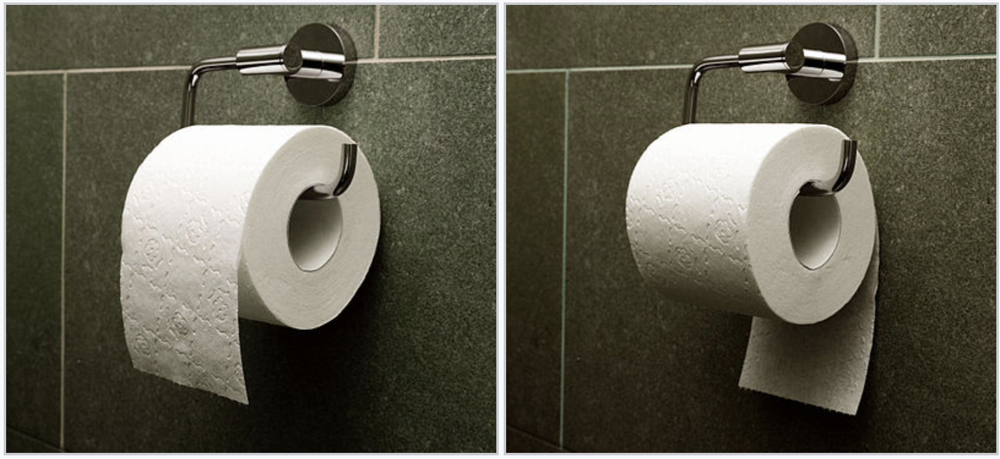

# Categories, counts, and kinds {#categories}

### Two Kinds of People {-}

"There are two kinds of people... which one are you?" questions have become something of an internet meme, particulary with the categorizations represented graphically or pictorially. There is a whole [blog devoted to them by João Rocha](https://2kindsofpeople.tumblr.com/). The images in Figure \@ref(fig:tp-fig) probably need no explanation, as they concern the great [toilet paper orientation](https://en.wikipedia.org/wiki/Toilet_paper_orientation) debate.


(ref:tpcaption) The great debate. Source [Wikimedia Commons User:Elya](https://commons.wikimedia.org/wiki/File:Toilet_paper_orientation_over.jpg) 

```{r tp-fig, echo=FALSE, out.width='90%', fig.show='hold', fig.cap='(ref:tpcaption)'}

```


Toilet paper orientation is a distinguishing **test question** that separates people into one of two "kinds" (or "types" or "categories"; sometimes English has several words that are used interchangeably). A fancy word for this "splitting into two" is dichotomy (die-COT-uh-mee), from the Greek.  A **dichotomous question** has two possible answers. Here, you choose one way to orient the roll or the other. Let's call this roll choice "over" (shown on left) or "under" (shown on right). Perhaps you have debated which is better with a friend or family member. In any case, armed with this particular test question, we can go out and collect some data. 


```{r echo=FALSE}
set.seed(201905071)
nump <- 40
probTP = 0.75
binomial_draw <- rbinom(nump,1, prob=probTP)
theWayIRoll <- ifelse(binomial_draw==1, "over", "under")
TPcounts <- as.data.frame(table(binomial_draw), row.names=c("under", "over"))
```

```{r tp-table, echo=FALSE}

kable(table(theWayIRoll), col.names = c("", "count"), caption="How people roll", booktabs = TRUE) %>%
  kable_styling(bootstrap_options = "striped", 
                full_width = F) %>%
  kable_styling(latex_options = c("hold_position"))


# TPcounts %>% select(counts=Freq) %>%
#   kable(., caption="How I Roll", booktabs = TRUE) %>%
#   kable_styling(bootstrap_options = "striped", full_width = F, position = "float_right")

```

I went ahead and asked `r nump` people in Washington Square Park in New York City which kind of person they were, and the results are shown in Table \@ref(tab:tp-table). This being a book about data science, you might think I'm going to start calculating proportions right away, for example by saying that `r 100*round(prop.table(table(theWayIRoll))["over"],3)`% of New Yorkers are over-hangers. 
Nope. Although you should be able to figure out that proportion conversion, it is not the point I want to focus on right now. 

That point I want to focus on is that, based on our data, there *are* indeed two kinds of people here. If, for example, everyone in the world were an under-hanger (heaven forbid), then I couldn't very well say that there were two kinds of people in this world. At least not with regard to toilet paper orientation. It would be like if I presented you with the data in Table \@ref(tab:dumb-table). Looking at that, I can't very well convince you that there are two kinds of people.


```{r dumb-table, echo=FALSE}
iamaperson <- data.frame(count = c(nump,0), 
              row.names = c("human","not human"))
kable(iamaperson, 
      caption="Kinds of people in Washington Square",
      booktabs = TRUE) %>%
  kable_styling(bootstrap_options = "striped", 
                full_width = F) %>%
  kable_styling(latex_options = c("hold_position"))

```

That all seems pretty obvious, in part because I made up a *tautology* in the second example there. Being a human being is automatically associated with everyone who can be a *kind of person*. 

But what if I had gotten exactly the same results for the toilet paper question? What if the data looked like Table \@ref(tab:tp-redux). In this **alternate universe**, everyone I ask in Washington Square is an under-hanger. Yes, it's one of those scary alternate universes, like the Twilight Zone. Anyway, does that mean that there is only one kind of person when it comes to toilet paper orientation? Well...not necessarily. After all, this was just a **sample** of people in Washington Square. It was not the whole **population** of Washington Square, even, let alone New York City, let alone the world.


```{r tp-redux, echo=FALSE}
iamaperson <- data.frame(count = c(nump,0),
                         row.names = c("under", "over"))
kable(iamaperson, 
      caption="How people roll (alternate universe)",
      booktabs = TRUE) %>%
  kable_styling(bootstrap_options = "striped", 
                full_width = F) %>%
  kable_styling(latex_options = c("hold_position"))

```

### Samples and Populations: A Statistical Caveat {-}  

Samples and populations are sort of a big deal in statistics and data science, where these words have somewhat specialized meanings. Consider the following utterances:

```
The population of New York City is 8.6 million
The population of New York City is ethnically diverse
```

How can both of these statements make sense? In common usage, population often refers to the number or count of people, in a town, area, or country. Among statisticians and data scientists, population refers to a set or collection under consideration. It doesn't have to be a set of people. It could be a set of rats, non-governmental organizations, or domestic flights originating in Chicago. But let's suppose the population does refer to a set of people. The *number* of those people is just one summary about the population, also known as the total **count**. The proportion of over-hangers is another summary of the population, as is the most-common birth-month. The two statements above would be more consistent if the first were rephrased to be: the population (set of people) of New York City ~~is~~ numbers 8.6 million.

If we always had access to all of the members in a population (the set or collection under consideration), the field of statistics wouldn't exist. We would just know a bunch of facts about, say, everyone in the whole world. And that would be that. While it is true that data are becoming more and ubiquitous, don't start betting on the demise of statistics. Even if we did have complete data for everyone in the world today, our population of interest might extend to the world as it will be next month, next year, or ten years from now. That is, we might want to make predictions about the future. In which case, we would want to draw *inferences* and to generalize from the data we have on hand---our sample---to data we don't have---the rest of the (i.e., the future) population. Making inferences from samples to populations will always be a compelling and challenging problem.

Since Washington Square is the center of my universe, that's where I sample. Even if we agreed that our population of interest were confined to Washington Square, we would still find it difficult to collect data on everyone there. There are a lot of them, many of them are on skateboards, and new people keep leaving and entering the park. It turns out, that's okay. We don't actually have to reach everybody to be able to do data science. However, we need to understand that when we sample 40 particular people in Washington Square, we might not get the same exact answers as if we had sampled 40 *different* people. The sampling process introduces an element of **uncertainty** into our process.

Coming back to our toilet paper debate, if we did find zero over-hangers in one sample, it doesn't guarantee that the number of over-hangers will also be zero in the next. The number may vary from sample to sample. Uncertainty does not, however, mean that the information derived from one sample is useless. In fact, soon we'll see that we can actually learn a lot from a sample simply by recognizing that sample values will vary. We can simulate samples on a computer to see how much they will vary. And then, using our simulations, we will be able to give probabilistic answers to questions like, "what are the chances that there really are no over-hangers in Washington Square?"

### A Psychological Caveat {-}

The section above explored a statistical caveat about drawing conclusions from samples. But another caveat that applies here is more psychological. I have assumed, for this argument, that a person's answer to the toilet paper question is a fairly stable thing and not just a transient state-of-mind. That is, if I asked you tomorrow or next week, your answer would be the same as if I asked you today. For the most part. I'm not saying you can't ever decide to change your mind. But it wouldn't make sense to describe a person as an over-hanger if there were no stability at all to their answer. A transient state-of-mind, by contrast, could be asking someone if they are hungry. Everyone is hungry some of the time, but not all of the time. And it wouldn't make any sense, based on that line of questioning, to imply that there are two kinds of people. 

### Summarizing data {-}

When I presented my survey results to you in Table \@ref(tab:tp-table), notice that I did not present you with the raw data, but rather with a summary of the data. The particular summary I used was called "counts", that is, a total count of how many people responded "over" or "under." The raw data, in contrast, would have contained each individual response I collected, labled either with a name of the individual, or perhaps with some other unique identifier (such as a random number), or---if I don't need to keep track of particular individuals---with just a row number. Something like this, if we examine at the first six responses rather than all 40 of them. Raw data:

```{r, echo=FALSE}
rawdata <- data.frame(row = 1:length(theWayIRoll), randomID = 
                        round(runif(length(theWayIRoll),
                        min=1000, max=9999)),
                        response=theWayIRoll)
kable(head(rawdata), align = 'ccc', booktabs=T) %>%
  kable_styling(latex_options = c("hold_position"))
```

Counts is an example of a **summary statistic**, which is a fancy term for a number that is derived from the raw data. The count summary is as simple as it gets. It is literally the number of times that each response appears. We might note as well that, 

```
count(under) + count(over) = total number of responses.
```

This mathematical statement is true because there are only two possible responses. If there were more than two responses, then I would need to add the counts for each possible response. 

Note that the *proportion* of "over" responses is also a summary statistic (which is just the counts of "over" divided by the total number of responses). Another summary statistic could be the ratio of "over" responses (counts) to "under" responses. For example, one way people use summary statistics in reporting data is through statements like, "twice as many people prefer chunky peanut butter to smooth." 

#### No mean feat {-}

> Whenever someone reports a mean (another word for average) value of some set of data, that is also a summary statistic. Does it make sense to construct an average from responses that are either "over" or "under"? No, it doesn't. That's because {over, under} is a categorical response, and you can't average over categories. Unless you're trying to make fun of statistics with a puerile joke. Different versions of this joke appear: "the average American has one tit and one testicle." At the risk of explaining the joke too much, here goes: Tits and testicles can certainly be treated as numerical data, and hence can be averaged. This joke hinges on the fact that the existence of testicles (or tits) is associated with a person's sex, which is categorical and not numerical. Assuming that half of all Americans are female (roughly true), we can't say that the average American is half male and half female. The real "punch" of this joke is to suggest that summary statistics about averages are just a bunch of nonsense. What do you think?

This is about as much as we need to say about summary statistics for the time being. But they'll be back. 


### Checkpoint {-}  

While focusing on the great toilet paper debate, we've managed to establish some important fundamental ideas. 

- Dichotomous questions split people into two kinds, but only as long as it is actually possible for both answers to occur. 

- In an alternate universe, people might give different answers than they do in this one. (Seriously, this is an important idea).

- Even when we casually refer to *people*, we may have a particular set of people, a population, in mind. Data about this population are likely to come from a sample, rather than from the whole population, and this fact introduces some uncertainty into claims about the whole population. Data science to the rescue!

- If we have types of people in mind, our questions ought to elicit fairly stable answers

- Clearly, we can ask people questions that prompt them to choose between more than two categories. But "two types of people" questions are more fun.^[That was another unsubstantiated claim.] I mean there are so many of them! So... does that mean that there really are two types of people? To answer this, we will need to get into another great debate.  
