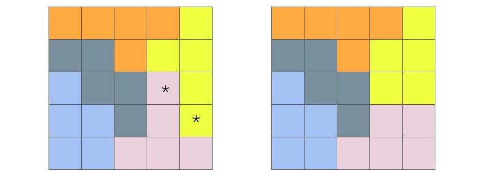
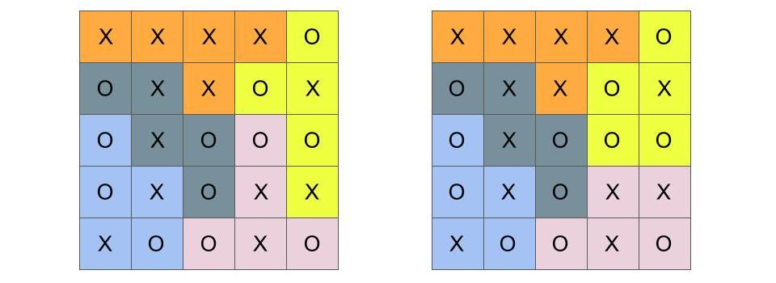

# Gerrymandering

Gerrymandering is an awesomely complex topic at the intersection of politics and data science. Almost everyone seems to be unhappy about it, and no one really knows how to fix it. That is, without a radical revision of how elections work in the United States. In this chapter, we'll take some steps to understand the problem and what data science can and cannot do to shed light on a possible solution. 

We'll spend a lot of time talking about gerrymandering in a simplified model.  Namely, we'll imagine that maps are squares made up of smaller squares, representing units of voters, and that there are two parties, represented by different colors or letters. While it is true that the simple models we start with are oversimplified, don't necessarily take this to mean that they can't help us to understand genuinely complex phenomena. Sometimes, simplicity is a function of grain size. As in, if you zoom in on a photograph, eventually you will see the individual pixels. And these are simple dots of color. But if you zoom back out again, the full complexity of the image is there. It is just built up from a lot of simple parts. So if we can understand gerrymandering on a small/microscopic scale, the full-scale problem might just be bigger rather than fundamentally different. 

## How to play the gerrymandering game {-}


```{r gerrymandering-simple, echo=FALSE, out.width='90%', fig.show='hold', fig.cap="The effect of moving districts around"}  

include_graphics("images/gerrymandering_simple.jpeg")  

```  

Figure \@ref(fig:gerrymandering-simple) helps to explain how gerrymandering works in a simple case. There is nothing better for developing an intuition about "packing and cracking" voters as doing it yourself, and there are several online simulations that let you do just that. I'm personally a fan of this one: http://polytrope.com/district/


In this first illustration, we can see three ways to divide 50 people into five districts. The first two are nicely shaped but have different outcomes. In the first, the representation is perfectly proportional. In the second, red voters win no seats at all. In the third, red wins 3 out of 5 districts, or 60% of the seats, even though only 40% of the voters belong to the red party. It is in the third set that the boundaries appear to be deliberately manipulated. The blue voters are either "packed" into long U-shaped districts (along the right side) where many of their votes are wasted. Or they are "cracked" into just-under-majority-sized chunks in the districts on the left-side, where, again, their votes are wasted. In this way, red overcomes a minority of the population to win a majority of the seats.


```{r gerrymandering-simple2, echo=FALSE, out.width='90%', fig.show='hold', fig.cap="The effect of moving people around"}  

include_graphics("images/gerrymandering2.jpeg")  
```  

Figure \@ref(fig:gerrymandering-simple2) reproduces another simple illustration, used by Moon Duchin, one of the leading figures contributing to the understanding of the mathematics of gerrymandering (see her organization's work at https://mggg.org/ and also find her recorded talks on YouTube). Suppose there are two kinds of voters in a state, chartreuse and mauve. And suppose the state population is 59% mauve and 41% chartreuse. As Duchin shows, in a situation with five districts, numbered I-V using Roman numerals, the minority party may end up with anywhere between 0% and 80% of the representation (0 to 4 seats) in state government. 

You can imagine that you took all of the chartreuse people in district V and moved one quarter of them each to districts I through IV. Since the districts have a fixed population size, you then moved the excess mauve voters into district V to replace the chartreuse voters you took out.

A few things to note about this second illustration, in combination with the first. For one, the color choices don't matter. Okay, that's not really an important point. First important point: you can change outcomes by moving districts or by moving people. This is *actually* important. Not because politicians trying to get re-elected will force people to move. But because people do move on their own, and because they also sometimes clump together geographically. For example, big city and college-town dwellers are more likely to be Democrats. In this sense, they are naturally self-packed, even though no one forced it. 

In the first illustration, we see that you can draw funny shapes to tilt the outcomes of the election in favor of red. In the second illustration we see that the shapes remain the same, but the outcomes still vary depending on where the chartreuse and mauve voters are. In other words, the effect of district boundaries on outcomes is an *interaction* or combination of the shape of the boundaries and the actual location of the voters themselves.


::: {.tipblock data-latex=""}
It is important to pause here to note that proportional representation, while appealing, is not the opposite of gerrymandering. As Duchin says, "the opposite of gerrymandering is 'not gerrymandering.'" We'll come back to see the wisdom of that remark. Critically, there are times when the geographical distribution of voters in the minority party may be such that, under current voting systems, they will not win proportional representation. Even if there is no gerrymandering at all.
:::


## The politics of gerrymandering {-}

This section of the chapter is going to be a short aside before we move on to the math of gerrymandering. However, it is important to note that there are in fact various legal and constitutional **redistricting criteria**, or constraints, on drawing district borders that take precedence over other optimization considerations. These can include obvious things like contiguity---districts should be connected---and preservation of town or county boundaries. And they can include more subtle factors like preservation of communities of interest or even the deliberate pursuit of competitive elections. There are federal regulations, for example regarding equal representation and race-based discrimination. And, on top of that, each state also makes their own rules. 

The National Conference of State Legislatures describes where each state stands, on both legislative and congressional districts, here: https://www.ncsl.org/research/redistricting/redistricting-criteria.aspx

The data journalists at fivethirtyeight.com have produced an excellent podcast series exploring different cases studies in Wisconsin, North Carolina, Arizona, and California. It can be found, along with other resources, here:
https://fivethirtyeight.com/tag/the-gerrymandering-project/

And now back to the math...


## The math of gerrymandering {-}

This is the fundamental question for the math, or data science, of gerrymandering:

*Is there a quantitative method that can help someone (e.g., a legistlature, independent commission, or a court) decide whether a districting plan is fair or unfair?* 

 After this much time, we have come to see that judging a district as unreasonable just because it has an odd shape is not a reliable formula. People like district boundaries to be more like a blob than a tentacle-monster. But (a) sometimes geographical considerations force irregular shapes, and (b) irregular shapes are not necessarily unfair to any group of voters. Which brings us to the real issue, what do we mean by fair? A lot of mathematical and legal thought has been given to this, but we're going to limit ourselves to one particular idea.

### Unfairness as deviation from expected outcomes under fair play {-}

In the previous chapters, we have looked at disparate outcomes in athletics (NBA heights, NHL birthdays, sex differences in running times) and health (e.g., COVID-19 case and fatality rates by age, ethnicity, or socioeconomic status). We came to accept that some disparities might be considered "fair play" or even "tough luck", while others might be evidence of bias.
We would like to apply the same kind of thinking to the analysis of gerrymandering. 

Let's start by considering the case of Massachusetts, which is divided into 9 congressional districts. Massachusetts is heavily Democratic; Republicans amount to about 30% of voters. You might think that a fair outcome would be if Republican candidates won approximately 30% of the 9 congressional seats in Massachusetts. Perhaps two or three. In fact, all 9 are held by Democrats, and a Republican has not won a congressional election in Massachusetts since 1993 (although the governor's office has frequently been held by Republicans). What gives? Is this proof that some kind of gerrymandering is going on? The answer is no. It turns out that *there is no way to draw districts in Massachusetts (that satisfy federal and state redistricting criteria) such that Republicans would win a congressional seat.* The Republican voters are simply too spread out. They are not packed tightly enough to draw a legal district that is majority Republican. (It takes some pretty cool computational methods to be able to answer this question definitively, as we shall see later).

The situation for Republican voters in Massachusetts, under current voting laws, may indeed be tough luck. But if you have followed the legal challenges in states like Wisconsin, Maryland, and North Carolina, you know that there are accusations of unfair play. In those cases, someone is saying that the districting plan itself is to blame for an outcome that was not necessarily expected based only on redistricting criteria and voter geographic distribution. The lawsuits charge that  legislators have put their thumbs on the scale to tip the outcomes of elections in their party's favor, unfairly diluting the voting power of individuals.

It feels like the following might be, at least in principle, an approach to the our fundamental question. Suppose we know where the voters are. We also know how many districts we have to draw. The districts, by federal law, have to be equal-in-population. There may be other requirements. If we can enumerate all of the legal district assignments, we can get a distribution of election outcomes. (Alternate universes, anyone?) If we find what "typical" outcomes look like when there is no agenda involved, we'll be able to recognize highly unusual outcomes. Maybe this can be a basis for judging, and possibly ruling out, what seem to be obviously biased districting plans.

Let's try it! We'll start small. You'll see why.

### This just might work {-}

Say that there are 4006 possible district assignments or plans. What is the outcome of the election in each of these 4006 plans, given some particular voter geographical distribution? 

Why did I choose 4006? It turns out that this is exactly how many ways you can divide a 5x5 grid into 5 districts. I should add that this number includes the following constraints: districts must be equal in size (5 units each) and be connected and fully reachable by moving up/down and left/right on the grid map. No diagonal hops or other jumps should be required to stay within a district. (If you are conversant with chess as a thinking tool, it might help that mathematicians refer to these shapes on the grid as rook-contiguous; it is also possible to consider queen-contiguous districts, but we won't. If you don't play chess, don't worry about it.)

```{r gerrymandering-5x5-1, echo=FALSE, out.width='80%', fig.show='hold', fig.cap="Two possible maps dividing a 5x5 grid into 5 districts. The districts are equal in size and rook-contiguous. The map on the right can be obtained from the map on the left by swapping the distict assignments of the two starred squares."}  
  

```  

Figure \@ref(fig:gerrymandering-5x5-1) shows two of the 4006 possible ways to divide a 5x5 grid into 5 equal-sized, contiguous districts. It would take up a lot of space to show them all, but you can see how to build them step by step here: https://mggg.org/metagraph/5x5.html

The two plans I've shown have a special relationship, which will become important later. The plan on the right can be obtained from the plan on the left by swapping the distict assignments of the two starred squares. What I mean is,  we assign one pink square to yellow and vice versa. We can think of the plans as being one swap away from one another, since a swap always involves trading one square. Note that not all swaps would be "legal", because some would make the resulting districts no longer contiguous. That's all we want to say about the relationship between these two plans for now. Let's move on to thinking about how each district plan actually matters in terms of election outcomes.

The consequences of a particular district map depends of course on the geographical location of the actual voters. If each square represents one unit of voters, one possible scenario for locating the voters is shown in Figure \@ref(fig:gerrymandering-5x5-2). 


```{r gerrymandering-5x5-2, echo=FALSE, out.width='80%', fig.show='hold', fig.cap="A possible map of voters, labeled X and O on a 5x5 grid. The map is the same on both sides. It is shown twice to maintain the spatial relationship between the related figures above and below."}  
include_graphics("images/gerrymandering5x5_2.jpeg")  

```  

Here we have a geographic distribution of 13 X-voters and 12 O-voters. By removing the color-boundaries of the districts, we can imagine that the people/voters live where they live without regard to political boundaries. This is sometimes true, but not necessarily. (Can you think of reasons why voters aligned with the same party might deliberately live within certain districts?) In any case, we will treat this geographical distribution as fact and fixed.


```{r gerrymandering-5x5-3, echo=FALSE, out.width='80%', fig.show='hold', fig.cap="Two district maps, as before, now with the same underlying voter distribution"}  
  

```  

Let's now add the boundaries back, so we can see the voters and the boundaries at the same time. These are shown in Figure \@ref(fig:gerrymandering-5x5-3). If an election were held in each these five districts, who would win? If you look at each mapping, you can see whether X- or O-voters are the majority. To make it easier to focus on the outcome, which you probably were able to figure out on your own, I've recolored the district boundaries using only orange and shades of gray in Figure \@ref(fig:gerrymandering-5x5-4).

```{r gerrymandering-5x5-4, echo=FALSE, out.width='80%', fig.show='hold', fig.cap="Two district maps, as before. The majority-X districts are now colored orange, while the majority O districts are shades of gray."}  
include_graphics("images/gerrymandering5x5_4.jpeg")  

```  

Let's recap what we know so far. We've looked at two (out of 4006) possible plans which divide a 5x5 grid into 5 districts. We recognize that districts can be redrawn, and that these two district assignments are in a sense "close" to each other, because one swap along neighboring districts can turn one plan into the other. We then fixed in place the distribution of X- and O-type voters. (This is where the voters are, and we won't try to move them). We see that in the district plan on the left, X-voters win one seat out of five, while in the district plan on the right, X wins two seats. We stand back and scratch our heads, because X-voters actually form a small majority (13 out of 25), but they have a minority of seats in both of these possible districting plans.

Is the map on the left a gerrymander? The map on the right? How would we decide? There are 4006 alternative plans, including the two shown above. We can ask: given that the voters are where they are, what would the election outcomes be under all 4006 plans? This number may seem large if you were doing the work by hand, but it is a piece of cake for a computer. The answer is shown in Figure \@ref(fig:gerrymandering-5x5-5). This is a screen-capture from the mggg.org interactive, which I used to cook up this example.

(ref:foo) Figure \@ref(fig:gerrymandering-5x5-2)

```{r gerrymandering-5x5-5, echo=FALSE, out.width='80%', fig.show='hold', fig.cap="A barplot/histogram showing counts of the election outcomes for all 4006 possible plans, given the geographic distribution of voters in (ref:foo)"}  
include_graphics("images/gerrymandering5x5_5.jpeg")  

```  

As shown in Figure \@ref(fig:gerrymandering-5x5-5), X-voters can win anywhere from 1 to 4 seats. There is no way to draw a plan in which they win all seats. Nor is there a way to draw a plan in which they win none. Note that the modal outcome (the most common one) is two seats. Even though X has a slight majority, they will win just two seats under 56% of the possible plans and three seats in 38% of the plans. This suggests that maybe the X-voters self-pack, to their own electoral detriment. Also interesting, the outcome of the left plan, in which X wins only one seat, happens in 194 out of 4006 possible plans. This is just under 5%. Because X-voters self-pack, it is easier to find a plan in which they win one seat (194 possibilities) than a plan in which they win four seats (61 possibilities). But both of those extremes are pretty rare, and either of them might set off our gerrymander-alarm. A legislature dominated by the O party might try to enact a plan like the one on the left. A legislature dominated by the X party might try to enact one in which X wins four seats. (Want to find it? You can try using the mggg.org interactive linked above to recreate the voter distribution. You will substitute hearts and clubs for Xs and Os).


### The combinatorics of gerrymandering {-}

Enumerating the district plans, computing outcomes based on geographical voter distribution, and looking for outliers seems like a good idea! Unfortunately, there's a catch. Fortunately, there's a potential solution to the catch. First, though, the catch.

So, a 5x5 grid is obviously too simple. But we're using computers, right? We should be able to make larger grids that are big enough to simulate real districts. Right? Unfortunately, the combinatorics^[The branch of mathematics dealing with combinations of objects belonging to a finite set in accordance with certain constraints, such as those of graph theory.] is not on our side. The sheer number of possible districting plans grows very large, very fast.

If instead of a 5x5 grid, we used a 7x7 grid and divided it into 7 districts, there would be 158,753,814 possible ways to do it. That's bad but maybe not so bad, for modern computers. For a 9x9 grid into 9 districts, however, the number is 706,152,947,468,301. That's 706 trillion. For 10x10 into 10, we don't even know the answer. For real. A cluster of computers at MIT crashed after a month of brute force computation before it finished enumerating all of the possibilities. Regardless of the exact number, we know that it's too big. We just can't expect to simulate all possible outcomes of an election even for a model as small as 10x10. (More numbers, including counts of plans where the district populations are not exactly equal, can be found here, along with code links: https://mggg.org/table.html)

For a realistic context, consider the fact that in the state of Pennsylvania, there are over 9000 precincts (think of a 95 x 95 grid), which must be cobbled together into not only 18 congressional districts but also 50 state senate districts and 203 state house districts. The number of possible divisions is staggering. 

So this is the catch. It is computationally intractable to simulate all of the districts. I told you that there was a potential solution, though.

### Move over brute force, hello random walk sampling {-}

The main idea of sampling in statistics is that your don't have to have all the data all the time. If you want to get a good sense of how a variable is distributed in the population, it often suffices to get a reasonably large and representative sample. Opinion polls often have sample sizes of about 1000, and the reported margin of error is small (within a few percent). In our simulation studies, we have even used simulated samples. For example, in the beer taste test. If it were true that Schlitz and Michelob taste the same, we can make confident predictions about the range of outcomes of a taste-tester sample of 100. So the first idea we want to carry over to the math of gerrymandering is the idea of sampling from the very large space of district plans.

This does not solve our problem, though, because generating valid district plans from scratch and automatically is actually not that easy. For example, I can't, in the case of the 5x5 grid, choose 5 squares at random and expect them to form a legal, contiguous district. They might just be sprinkled around the map. What I can do, though, is start with a legal district plan and turn it into another legal district plan, one swap at a time.

Recall Figure \@ref(fig:gerrymandering-5x5-1). There we saw a swap between neighboring districts that changed one plan into another plan. Imagine that we keep this process moving along. In each turn, we pick two districts at random, see if there is a legal swap that can be made, and, if so, make the swap. In the process, we will keep sampling from the set of district plans.

The method of taking one swap step (in a random direction) after another is called a random walk. The outcome of (part of) a random walk can be seen animated here: https://mggg.org/metagraph/7x7.html


To be completely fair, this method of sampling is not obviously a random sample from the set of all district plans. Each district plan that we visit was conditional on the last plan we had. We had a random choice of which step to take, but that still excluded a huge number of plans that were more than one swap-step away. So you would be totally right to ask whether taking each step as a sample of district plans is a legitimate way to sample from all of the possibilities.^[Consider the following counterexample. Suppose I want to sample NYU students. The way I do this is I find a student at random, ask them my question, and then ask them if they can recommend a friend of theirs. I then ask the same question to the friend and, as before, ask them to recommend a friend.  Each person may choose their recommended friend at random. And so, in a sense, this is a random walk. However, I would be very unlikely to get a random sample of NYU students this way. I may get a random sample of a particular social group, but I may easily get stuck in one "part" of NYU. This would be a case where my random walk is not sampling adequately from the whole population.] 

This is actually a profound mathematical question in all instances of *Markov Chain Monte Carlo*, which is the fancy term for random walk sampling. Namely, we want to know whether the "chain"---the sequence of results we have visited on our randomw walk---is representative of the whole distribution.

There are a few ways to try to answer this. One of the simplest ways is to start the random walk multiple times from the same and different starting points. Maybe we take 10,000 steps each time we start. We will have visited 10,000 district plans on our chain. We count the number of seats won by each party and make a histogram. We then repeat this again and again with different starting configurations. If the distribution of outcomes from the different chains are similar to one another, then it is plausible that the chains are indeed representative of the whole set of possible plans.

So here's the update of our original idea. Rather than enumerate all possible district plans, we will use random walk sampling to find the distribution of election outcomes. We can do this with simple models first, like 10x10 grids, to convince ourselves that it works (it does!). And then we can do it with real data. Here is an example of data submitted as part of an *amicus brief* submitted by mathematicians (and lawyers) to the Supreme Court in Rucho v. Common Cause. The figure concerns two districts in North Carolina, under random walk samples of alternative district boundaries (source: https://mggg.org/SCOTUS-MathBrief.pdf)


```{r amicus-NC, echo=FALSE, out.width='70%', fig.show='hold', fig.cap="Figures submitted in the mathematicians' brief to the Supreme Court in Rucho v. Common Cause"}  
include_graphics("images/amicus_NCdist.png")  

```  

North Carolina Districts 10 and 11 both tend toward small Democratic majorities under most plans that conform to the rules. These "random" alternate plans are represented by the light blue distribution. The horizontal axis shows the DEM vote share in the district, which varies if the district borders are altered. The orange and purple dots show the vote share under plans created by Republican legislatures in 2012 and 2016. In these plans, the Democrat voters are "cracked" in District 10 to minority status and "packed" in District 11, so that their votes are diluted.


<!-- #### Caveat No. 1: It's still more complicated because of incomplete data {-} -->

<!-- Looks convincing -->
<!-- I'll be brief in delivering the bad news. The simple models we have discussed so far assume that we know where the voters live (Xs and Os, chartreuse and mauve, every person is a square!). We don't. Even if the census were perfect, party affiliation is not a census question. The quality of available data about voters vary widely by state, district, and municipality. At best, we know the proportion of votes from a particular polling place (where you vote). Unfortunately we don't know who voted there, if that person moved, or that polling place will even draw voters from the same blocks next election. Municipal polling place assignments change; this is controlled by municipalities, and records are not necessarily easy to come by.  -->

<!-- Because we have only approximate information about where the actual voters live at any given time, one of the ways data scientists look for irregular outcomes is by comparing them to actual outcomes in past elections.  -->

<!-- Finally,  -->


### Seat-count is not the only (or most common) outcome measure {-}

For most of this chapter we looked at simple models and simple outcomes, namely total seat count in some representative government body. As you can see in Figure \@ref(fig:amicus-NC), however, total seat count is not the only way to look at it. In fact, in trying to provide evidence about gerrymandering with respect to a single district, total seat count does not even make sense. Democratic vote share does. 

There are several measures that can account for the effect of diluting vote share through deliberate manipulation of district borders. Sam Wang, Princeton neuroscientist and Director of the Electoral Innovation Lab, writes, "To distinguish the effects of gerrymandering from happenstance, courts can try one of several possible objective measurements, all based on district-level returns, including the lopsided-averages test, the efficiency gap, and partisan bias."

You can read more about these different measures in Wang's writings here:

+ https://www.theatlantic.com/ideas/archive/2019/03/how-courts-can-objectively-measure-gerrymandering/585574/
+ https://web.math.princeton.edu/~sswang/wang16_ElectionLawJournal_gerrymandering-MD-WI_.pdf

Because the problem is complex, mathematicians appreciate the need for multiple measures, each of which may be sensitive to different kinds of discrepancies. At the same time, having multiple measures can make arguments more complicated in court. Judges are not mathematicians. But if the math is clear, they may be willing to consider it. Data scientists and mathematicians are still working on improving communication to the public and the courts. Convergent evidence---when multiple types of quantitative analysis lead to the same conclusion---has been persuasive in getting judges to reject plans in lower courts. For the time being, though, the Supreme Court of the United States is staying out of it.

